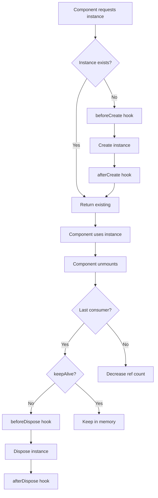

# Blac Class

The `Blac` class is the central orchestrator of BlaC's state management system. It manages all Bloc/Cubit instances, handles lifecycle events, and provides configuration options.

## Import

```typescript
import { Blac } from '@blac/core';
```

## Static Properties

### enableLog

Enable or disable console logging for debugging.

```typescript
Blac.enableLog: boolean = false;
```

Example:

```typescript
// Enable logging in development
if (process.env.NODE_ENV === 'development') {
  Blac.enableLog = true;
}
```

### enableWarn

Enable or disable warning messages.

```typescript
Blac.enableWarn: boolean = true;
```

### enableError

Enable or disable error messages.

```typescript
Blac.enableError: boolean = true;
```

## Static Methods

### setConfig()

Configure global BlaC behavior.

```typescript
static setConfig(config: Partial<BlacConfig>): void
```

#### BlacConfig Interface

```typescript
interface BlacConfig {
  enableLog?: boolean;
  enableWarn?: boolean;
  enableError?: boolean;
  proxyDependencyTracking?: boolean;
  exposeBlacInstance?: boolean;
}
```

#### Configuration Options

| Option                    | Type      | Default | Description                                 |
| ------------------------- | --------- | ------- | ------------------------------------------- |
| `enableLog`               | `boolean` | `false` | Enable console logging                      |
| `enableWarn`              | `boolean` | `true`  | Enable warning messages                     |
| `enableError`             | `boolean` | `true`  | Enable error messages                       |
| `proxyDependencyTracking` | `boolean` | `true`  | Enable automatic render optimization        |
| `exposeBlacInstance`      | `boolean` | `false` | Expose Blac instance globally for debugging |

Example:

```typescript
Blac.setConfig({
  enableLog: true,
  proxyDependencyTracking: true,
  exposeBlacInstance: process.env.NODE_ENV === 'development',
});
```

### log()

Log a message if logging is enabled.

```typescript
static log(...args: any[]): void
```

Example:

```typescript
Blac.log('State updated:', newState);
```

### warn()

Log a warning if warnings are enabled.

```typescript
static warn(...args: any[]): void
```

Example:

```typescript
Blac.warn('Deprecated feature used');
```

### error()

Log an error if errors are enabled.

```typescript
static error(...args: any[]): void
```

Example:

```typescript
Blac.error('Failed to update state:', error);
```

### get()

Get a Bloc/Cubit instance by ID or class constructor.

```typescript
static get<T extends BlocBase<any>>(
  blocClass: Constructor<T> | string,
  id?: string
): T | undefined
```

Example:

```typescript
// Get by class
const counter = Blac.get(CounterCubit);

// Get by custom ID
const userCounter = Blac.get(CounterCubit, 'user-123');

// Get by string ID
const instance = Blac.get('CustomBlocId');
```

### getOrCreate()

Get an existing instance or create a new one.

```typescript
static getOrCreate<T extends BlocBase<any, any>>(
  blocClass: Constructor<T>,
  id?: string,
  props?: T extends BlocBase<any, infer P> ? P : never
): T
```

Example:

```typescript
// Get or create with default ID
const counter = Blac.getOrCreate(CounterCubit);

// Get or create with custom ID and props
const chat = Blac.getOrCreate(ChatCubit, 'room-123', {
  roomId: '123',
  userId: 'user-456',
});
```

### dispose()

Manually dispose a Bloc/Cubit instance.

```typescript
static dispose(blocClass: Constructor<BlocBase<any>> | string, id?: string): void
```

Example:

```typescript
// Dispose by class
Blac.dispose(CounterCubit);

// Dispose by custom ID
Blac.dispose(CounterCubit, 'user-123');

// Dispose by string ID
Blac.dispose('CustomBlocId');
```

### disposeAll()

Dispose all Bloc/Cubit instances.

```typescript
static disposeAll(): void
```

Example:

```typescript
// Clean up everything (useful for testing)
Blac.disposeAll();
```

### resetConfig()

Reset configuration to defaults.

```typescript
static resetConfig(): void
```

Example:

```typescript
// Reset after tests
afterEach(() => {
  Blac.resetConfig();
  Blac.disposeAll();
});
```

## Plugin System

### use()

Register a global plugin.

```typescript
static use(plugin: BlacPlugin): void
```

#### BlacPlugin Interface

```typescript
interface BlacPlugin {
  beforeCreate?: <T extends BlocBase<any>>(
    blocClass: Constructor<T>,
    id: string,
  ) => void;
  afterCreate?: <T extends BlocBase<any>>(instance: T) => void;
  beforeDispose?: <T extends BlocBase<any>>(instance: T) => void;
  afterDispose?: <T extends BlocBase<any>>(
    blocClass: Constructor<T>,
    id: string,
  ) => void;
  onStateChange?: <S>(instance: BlocBase<S>, newState: S, oldState: S) => void;
}
```

Example: Logging Plugin

```typescript
const loggingPlugin: BlacPlugin = {
  afterCreate: (instance) => {
    console.log(`[BlaC] Created ${instance.constructor.name}`);
  },

  onStateChange: (instance, newState, oldState) => {
    console.log(`[BlaC] ${instance.constructor.name} state changed:`, {
      old: oldState,
      new: newState,
    });
  },

  beforeDispose: (instance) => {
    console.log(`[BlaC] Disposing ${instance.constructor.name}`);
  },
};

Blac.use(loggingPlugin);
```

Example: State Persistence Plugin

```typescript
const persistencePlugin: BlacPlugin = {
  afterCreate: (instance) => {
    // Load persisted state
    const key = `blac_${instance.constructor.name}`;
    const saved = localStorage.getItem(key);
    if (saved && instance instanceof Cubit) {
      instance.emit(JSON.parse(saved));
    }
  },

  onStateChange: (instance, newState) => {
    // Save state changes
    const key = `blac_${instance.constructor.name}`;
    localStorage.setItem(key, JSON.stringify(newState));
  },
};

Blac.use(persistencePlugin);
```

Example: Analytics Plugin

```typescript
const analyticsPlugin: BlacPlugin = {
  afterCreate: (instance) => {
    analytics.track('bloc_created', {
      type: instance.constructor.name,
      timestamp: Date.now(),
    });
  },

  onStateChange: (instance, newState, oldState) => {
    if (instance.constructor.name === 'CartCubit') {
      const cartState = newState as CartState;
      analytics.track('cart_updated', {
        itemCount: cartState.items.length,
        total: cartState.total,
      });
    }
  },
};

Blac.use(analyticsPlugin);
```

## Instance Management

### Lifecycle Flow



### Instance Storage

Internally, BlaC stores instances in a Map:

```typescript
// Simplified internal structure
class Blac {
  private static instances = new Map<string, BlocInstance>();

  private static getInstanceId(
    blocClass: Constructor<BlocBase<any>> | string,
    id?: string,
  ): string {
    if (typeof blocClass === 'string') return blocClass;
    return id || blocClass.name;
  }
}
```

## Debugging

### Global Access

When `exposeBlacInstance` is enabled:

```typescript
Blac.setConfig({ exposeBlacInstance: true });

// Access from browser console
window.Blac.get(CounterCubit);
window.Blac.instances; // View all instances
```

### Instance Inspection

```typescript
// Log all active instances
if (Blac.enableLog) {
  const instances = (Blac as any).instances;
  instances.forEach((instance, id) => {
    console.log(`Instance ${id}:`, {
      state: instance.bloc.state,
      consumers: instance.consumers.size,
      props: instance.bloc.props,
    });
  });
}
```

## Best Practices

### 1. Configuration

Set configuration once at app startup:

```typescript
// main.ts or index.ts
Blac.setConfig({
  enableLog: process.env.NODE_ENV === 'development',
  proxyDependencyTracking: true,
});
```

### 2. Plugin Registration

Register plugins before creating any instances:

```typescript
// Register plugins first
Blac.use(loggingPlugin);
Blac.use(persistencePlugin);

// Then render app
ReactDOM.render(<App />, document.getElementById('root'));
```

### 3. Testing

Reset state between tests:

```typescript
beforeEach(() => {
  Blac.resetConfig();
  Blac.disposeAll();
});

afterEach(() => {
  Blac.disposeAll();
});
```

### 4. Manual Instance Management

Avoid manual instance management unless necessary:

```typescript
// ✅ Preferred: Let useBloc handle lifecycle
function Component() {
  const [state, cubit] = useBloc(CounterCubit);
}

// ⚠️ Avoid: Manual management
const counter = Blac.getOrCreate(CounterCubit);
// Remember to dispose when done
Blac.dispose(CounterCubit);
```

## Error Handling

BlaC provides detailed error messages:

```typescript
try {
  const instance = Blac.get(NonExistentCubit);
} catch (error) {
  // Error: No instance found for NonExistentCubit
}

// With error logging enabled
Blac.enableError = true;
// Errors are logged to console automatically
```

## Summary

The Blac class provides:

- **Global instance management**: Centralized control over all state containers
- **Configuration**: Customize behavior for your app's needs
- **Plugin system**: Extend functionality with custom logic
- **Debugging tools**: Inspect and monitor instances
- **Lifecycle hooks**: React to instance creation and disposal

It's the foundation that makes BlaC's automatic instance management possible.
