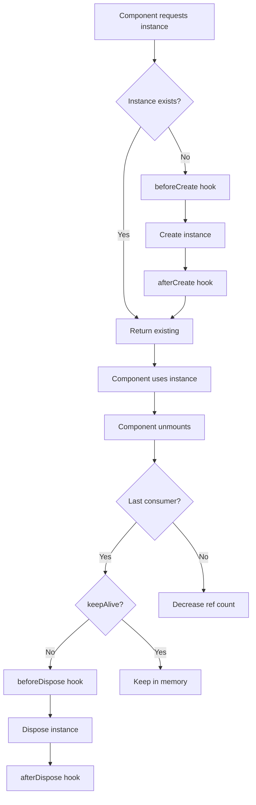

# Blac Class

The `Blac` class is the central orchestrator of BlaC's state management system. It manages all Bloc/Cubit instances, handles lifecycle events, and provides configuration options.

## Import

```typescript
import { Blac } from '@blac/core';
```

## Static Properties

### enableLog

Enable or disable console logging for debugging.

```typescript
static enableLog: boolean = false;
```

Example:

```typescript
// Enable logging in development
if (process.env.NODE_ENV === 'development') {
  Blac.enableLog = true;
}
```

### logLevel

Set the minimum log level for console output.

```typescript
static logLevel: 'warn' | 'log' = 'warn';
```

Example:

```typescript
// Show all logs including debug logs
Blac.logLevel = 'log';

// Only show warnings and errors (default)
Blac.logLevel = 'warn';
```

### logSpy

Set a custom function to intercept all log messages (useful for testing).

```typescript
static logSpy: ((...args: unknown[]) => void) | null = null;
```

Example:

```typescript
// Capture logs in tests
const logs: any[] = [];
Blac.logSpy = (...args) => logs.push(args);
```

## Static Methods

### setConfig()

Configure global BlaC behavior.

```typescript
static setConfig(config: Partial<BlacConfig>): void
```

#### BlacConfig Interface

```typescript
interface BlacConfig {
  proxyDependencyTracking?: boolean;
}
```

#### Configuration Options

| Option                    | Type      | Default | Description                          |
| ------------------------- | --------- | ------- | ------------------------------------ |
| `proxyDependencyTracking` | `boolean` | `true`  | Enable automatic render optimization |

Example:

```typescript
Blac.setConfig({
  proxyDependencyTracking: true,
});
```

### log()

Log a message if logging is enabled.

```typescript
static log(...args: any[]): void
```

Example:

```typescript
Blac.log('State updated:', newState);
```

### warn()

Log a warning if warnings are enabled.

```typescript
static warn(...args: any[]): void
```

Example:

```typescript
Blac.warn('Deprecated feature used');
```

### error()

Log an error message (when logging is enabled at 'log' level).

```typescript
static error(...args: any[]): void
```

Example:

```typescript
Blac.error('Failed to update state:', error);
```

### getBloc()

Get or create a Bloc/Cubit instance. This is the primary method for getting bloc instances.

```typescript
static getBloc<B extends BlocBase<unknown>>(
  blocClass: BlocConstructor<B>,
  options?: GetBlocOptions<B>
): B
```

#### GetBlocOptions Interface

```typescript
interface GetBlocOptions<B extends BlocBase<unknown>> {
  id?: string;
  selector?: BlocHookDependencyArrayFn<BlocState<B>>;
  constructorParams?: ConstructorParameters<BlocConstructor<B>>[];
  onMount?: (bloc: B) => void;
  instanceRef?: string;
  throwIfNotFound?: boolean;
  forceNewInstance?: boolean;
}
```

Example:

```typescript
// Get or create with default ID
const counter = Blac.getBloc(CounterCubit);

// Get or create with custom ID
const userCounter = Blac.getBloc(CounterCubit, { id: 'user-123' });

// Get or create with constructor params
const chat = Blac.getBloc(ChatCubit, {
  id: 'room-123',
  constructorParams: [{ roomId: '123', userId: 'user-456' }],
});
```

### disposeBloc()

Manually dispose a specific Bloc/Cubit instance.

```typescript
static disposeBloc(bloc: BlocBase<unknown>): void
```

Example:

```typescript
// Get bloc instance first
const counter = Blac.getBloc(CounterCubit);

// Later dispose it
Blac.disposeBloc(counter);
```

### disposeBlocs()

Dispose all blocs matching a predicate function.

```typescript
static disposeBlocs(predicate: (bloc: BlocBase<unknown>) => boolean): void
```

Example:

```typescript
// Dispose all CounterCubit instances
Blac.disposeBlocs((bloc) => bloc instanceof CounterCubit);

// Dispose all blocs with specific ID pattern
Blac.disposeBlocs((bloc) => bloc._id.toString().startsWith('temp-'));
```

### disposeKeepAliveBlocs()

Dispose all keep-alive blocs, optionally filtered by type.

```typescript
static disposeKeepAliveBlocs<B extends BlocConstructor<any>>(blocClass?: B): void
```

Example:

```typescript
// Dispose all keep-alive blocs
Blac.disposeKeepAliveBlocs();

// Dispose only keep-alive CounterCubit instances
Blac.disposeKeepAliveBlocs(CounterCubit);
```

### resetInstance()

Reset the global Blac instance, clearing all registrations except keep-alive blocs.

```typescript
static resetInstance(): void
```

Example:

```typescript
// Reset after tests
afterEach(() => {
  Blac.resetInstance();
});
```

## Plugin System

### instance.plugins.add()

Register a global plugin to the system plugin registry.

```typescript
Blac.instance.plugins.add(plugin: BlacPlugin): void
```

Example:

```typescript
// Create and add a plugin
const loggingPlugin: BlacPlugin = {
  name: 'LoggingPlugin',
  version: '1.0.0',
  onStateChanged: (bloc, previousState, currentState) => {
    console.log(`[${bloc._name}] State changed`, {
      previousState,
      currentState,
    });
  },
};

Blac.instance.plugins.add(loggingPlugin);
```

#### BlacPlugin Interface

```typescript
interface BlacPlugin {
  readonly name: string;
  readonly version: string;
  readonly capabilities?: PluginCapabilities;

  // Lifecycle hooks - all synchronous
  beforeBootstrap?(): void;
  afterBootstrap?(): void;
  beforeShutdown?(): void;
  afterShutdown?(): void;

  // System-wide observations
  onBlocCreated?(bloc: BlocBase<any>): void;
  onBlocDisposed?(bloc: BlocBase<any>): void;
  onStateChanged?(
    bloc: BlocBase<any>,
    previousState: any,
    currentState: any,
  ): void;
  onEventAdded?(bloc: Bloc<any, any>, event: any): void;
  onError?(error: Error, bloc: BlocBase<unknown>, context: ErrorContext): void;

  // Adapter lifecycle hooks
  onAdapterCreated?(adapter: any, metadata: AdapterMetadata): void;
  onAdapterMount?(adapter: any, metadata: AdapterMetadata): void;
  onAdapterUnmount?(adapter: any, metadata: AdapterMetadata): void;
  onAdapterRender?(adapter: any, metadata: AdapterMetadata): void;
  onAdapterDisposed?(adapter: any, metadata: AdapterMetadata): void;
}
```

Example: Logging Plugin

```typescript
const loggingPlugin: BlacPlugin = {
  name: 'LoggingPlugin',
  version: '1.0.0',

  onBlocCreated: (bloc) => {
    console.log(`[BlaC] Created ${bloc._name}`);
  },

  onStateChanged: (bloc, previousState, currentState) => {
    console.log(`[BlaC] ${bloc._name} state changed:`, {
      old: previousState,
      new: currentState,
    });
  },

  onBlocDisposed: (bloc) => {
    console.log(`[BlaC] Disposed ${bloc._name}`);
  },
};

Blac.instance.plugins.add(loggingPlugin);
```

Example: State Persistence Plugin

```typescript
const persistencePlugin: BlacPlugin = {
  name: 'PersistencePlugin',
  version: '1.0.0',

  onBlocCreated: (bloc) => {
    // Load persisted state
    const key = `blac_${bloc._name}_${bloc._id}`;
    const saved = localStorage.getItem(key);
    if (saved && 'emit' in bloc) {
      (bloc as any).emit(JSON.parse(saved));
    }
  },

  onStateChanged: (bloc, previousState, currentState) => {
    // Save state changes
    const key = `blac_${bloc._name}_${bloc._id}`;
    localStorage.setItem(key, JSON.stringify(currentState));
  },
};

Blac.instance.plugins.add(persistencePlugin);
```

Example: Analytics Plugin

```typescript
const analyticsPlugin: BlacPlugin = {
  name: 'AnalyticsPlugin',
  version: '1.0.0',

  onBlocCreated: (bloc) => {
    analytics.track('bloc_created', {
      type: bloc._name,
      timestamp: Date.now(),
    });
  },

  onStateChanged: (bloc, previousState, currentState) => {
    if (bloc._name === 'CartCubit') {
      const cartState = currentState as CartState;
      analytics.track('cart_updated', {
        itemCount: cartState.items.length,
        total: cartState.total,
      });
    }
  },

  onEventAdded: (bloc, event) => {
    // Track important events
    if (event.constructor.name === 'CheckoutStarted') {
      analytics.track('checkout_started', {
        blocName: bloc._name,
        timestamp: Date.now(),
      });
    }
  },
};

Blac.instance.plugins.add(analyticsPlugin);
```

## Instance Management

### Lifecycle Flow



### Instance Storage

Internally, BlaC stores instances in a Map:

```typescript
// Simplified internal structure
class Blac {
  private static instances = new Map<string, BlocInstance>();

  private static getInstanceId(
    blocClass: Constructor<BlocBase<any>> | string,
    id?: string,
  ): string {
    if (typeof blocClass === 'string') return blocClass;
    return id || blocClass.name;
  }
}
```

## Debugging

### Instance Inspection

```typescript
// Log all active instances
if (Blac.enableLog) {
  const instances = (Blac as any).instances;
  instances.forEach((instance, id) => {
    console.log(`Instance ${id}:`, {
      state: instance.bloc.state,
      consumers: instance.consumers.size,
      props: instance.bloc.props,
    });
  });
}
```

## Best Practices

### 1. Configuration

Set configuration once at app startup:

```typescript
// main.ts or index.ts
Blac.setConfig({
  enableLog: process.env.NODE_ENV === 'development',
  proxyDependencyTracking: true,
});
```

### 2. Plugin Registration

Register plugins before creating any instances:

```typescript
// Register plugins first
Blac.instance.plugins.add(loggingPlugin);
Blac.instance.plugins.add(persistencePlugin);

// Then render app
ReactDOM.render(<App />, document.getElementById('root'));
```

### 3. Testing

Reset state between tests:

```typescript
beforeEach(() => {
  Blac.setConfig({ proxyDependencyTracking: true });
  Blac.resetInstance();
});

afterEach(() => {
  Blac.resetInstance();
});
```

### 4. Manual Instance Management

Avoid manual instance management unless necessary:

```typescript
// ✅ Preferred: Let useBloc handle lifecycle
function Component() {
  const [state, cubit] = useBloc(CounterCubit);
}

// ⚠️ Avoid: Manual management
const counter = Blac.getBloc(CounterCubit);
// Remember to dispose when done
Blac.disposeBloc(counter);
```

## Additional Static Methods

### getAllBlocs()

Get all instances of a specific bloc class.

```typescript
static getAllBlocs<B extends BlocConstructor<any>>(
  blocClass: B,
  options?: { searchIsolated?: boolean }
): InstanceType<B>[]
```

Example:

```typescript
// Get all CounterCubit instances
const allCounters = Blac.getAllBlocs(CounterCubit);

// Get only non-isolated instances
const sharedCounters = Blac.getAllBlocs(CounterCubit, {
  searchIsolated: false,
});
```

### getMemoryStats()

Get memory usage statistics for debugging.

```typescript
static getMemoryStats(): {
  totalBlocs: number;
  registeredBlocs: number;
  isolatedBlocs: number;
  keepAliveBlocs: number;
}
```

### validateConsumers()

Validate consumer integrity across all blocs.

```typescript
static validateConsumers(): { valid: boolean; errors: string[] }
```

## Summary

The Blac class provides:

- **Global instance management**: Centralized control over all state containers
- **Configuration**: Customize behavior for your app's needs
- **Plugin system**: Extend functionality with custom logic
- **Debugging tools**: Inspect and monitor instances
- **Lifecycle hooks**: React to instance creation and disposal

It's the foundation that makes BlaC's automatic instance management possible.
