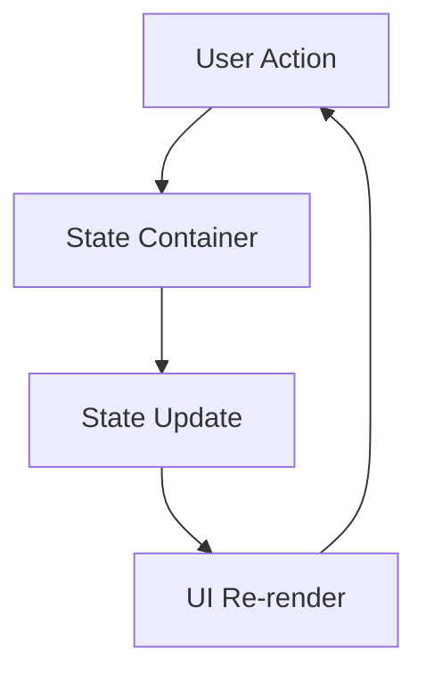

# State Management

Understanding state management is crucial for building maintainable React applications. This guide explores BlaC's approach to state management and the principles that make it effective.

## What is State?

In BlaC, state is:
- **Immutable data** that represents your application at a point in time
- **The single source of truth** for your UI
- **Predictable and traceable** through explicit updates

```typescript
// State is just data
interface AppState {
  user: User | null;
  theme: 'light' | 'dark';
  notifications: Notification[];
  isLoading: boolean;
}
```

## The State Management Problem

React components can manage their own state, but this approach has limitations:

```tsx
// ❌ Problems with component state
function TodoApp() {
  const [todos, setTodos] = useState([]);
  const [filter, setFilter] = useState('all');
  const [user, setUser] = useState(null);
  
  // Business logic mixed with UI
  const addTodo = (text) => {
    const newTodo = {
      id: Date.now(),
      text,
      completed: false,
      userId: user?.id
    };
    setTodos([...todos, newTodo]);
    
    // Side effects in components
    analytics.track('todo_added');
    api.saveTodo(newTodo);
  };
  
  // Difficult to test
  // Hard to reuse logic
  // Components become bloated
}
```

## The BlaC Solution

BlaC separates state management from UI components:

```typescript
// ✅ Business logic in a Cubit
class TodoCubit extends Cubit<TodoState> {
  constructor(
    private api: TodoAPI,
    private analytics: Analytics
  ) {
    super({ todos: [], filter: 'all' });
  }
  
  addTodo = async (text: string) => {
    const newTodo = { id: Date.now(), text, completed: false };
    
    // Optimistic update
    this.patch({ todos: [...this.state.todos, newTodo] });
    
    // Side effects managed here
    this.analytics.track('todo_added');
    await this.api.saveTodo(newTodo);
  };
}

// Clean UI component
function TodoApp() {
  const [state, cubit] = useBloc(TodoCubit);
  // Just UI logic here
}
```

## Unidirectional Data Flow

BlaC enforces a predictable, one-way data flow:



This pattern makes your application:
- **Predictable**: State changes follow a clear path
- **Debuggable**: You can trace every state change
- **Testable**: Business logic is isolated

## State Update Patterns

### Direct Updates (Cubit)

Cubits provide direct methods for state updates:

```typescript
class CounterCubit extends Cubit<{ count: number }> {
  increment = () => this.emit({ count: this.state.count + 1 });
  decrement = () => this.emit({ count: this.state.count - 1 });
  reset = () => this.emit({ count: 0 });
}
```

### Event-Driven Updates (Bloc)

Blocs use events for more structured updates:

```typescript
class CounterBloc extends Bloc<{ count: number }, CounterEvent> {
  constructor() {
    super({ count: 0 });
    
    this.on(Increment, (event, emit) => {
      emit({ count: this.state.count + event.amount });
    });
    
    this.on(Decrement, (event, emit) => {
      emit({ count: this.state.count - event.amount });
    });
  }
}
```

## State Structure Best Practices

### 1. Use Serializable Objects

Always use serializable objects for your state instead of primitives. This ensures compatibility with persistence, debugging tools, and state management patterns:

```typescript
// ❌ Avoid primitive state
class CounterCubit extends Cubit<number> {
  constructor() {
    super(0);
  }
}

// ✅ Use serializable objects
class CounterCubit extends Cubit<{ count: number }> {
  constructor() {
    super({ count: 0 });
  }
  
  increment = () => this.emit({ count: this.state.count + 1 });
}
```

Benefits of serializable state:
- **Persistence**: Easy to save/restore with `JSON.stringify/parse`
- **Debugging**: Better inspection in DevTools
- **Extensibility**: Add properties without breaking existing code
- **Type Safety**: More explicit about state shape
- **Immutability**: Clearer when creating new state objects

### 2. Keep State Normalized

Instead of nested data, use normalized structures:

```typescript
// ❌ Nested state
interface BadState {
  posts: {
    id: string;
    title: string;
    author: {
      id: string;
      name: string;
      posts: Post[]; // Circular reference!
    };
    comments: Comment[];
  }[];
}

// ✅ Normalized state
interface GoodState {
  posts: Record<string, Post>;
  authors: Record<string, Author>;
  comments: Record<string, Comment>;
  postIds: string[];
}
```

### 2. Separate UI State from Domain State

```typescript
interface TodoState {
  // Domain state
  todos: Todo[];
  
  // UI state
  filter: 'all' | 'active' | 'completed';
  searchQuery: string;
  isLoading: boolean;
  error: string | null;
}
```

### 3. Use Discriminated Unions for Complex States

```typescript
// ✅ Clear state representations
type AuthState = 
  | { status: 'idle' }
  | { status: 'loading' }
  | { status: 'authenticated'; user: User }
  | { status: 'error'; error: string };

class AuthCubit extends Cubit<AuthState> {
  constructor() {
    super({ status: 'idle' });
  }
  
  login = async (credentials: Credentials) => {
    this.emit({ status: 'loading' });
    
    try {
      const user = await api.login(credentials);
      this.emit({ status: 'authenticated', user });
    } catch (error) {
      this.emit({ status: 'error', error: error.message });
    }
  };
}
```

## Async State Management

BlaC makes async operations straightforward:

```typescript
class DataCubit extends Cubit<DataState> {
  fetchData = async () => {
    // Set loading state
    this.patch({ isLoading: true, error: null });
    
    try {
      // Perform async operation
      const data = await api.getData();
      
      // Update with results
      this.patch({ 
        data, 
        isLoading: false,
        lastFetched: new Date()
      });
    } catch (error) {
      // Handle errors
      this.patch({ 
        error: error.message, 
        isLoading: false 
      });
    }
  };
}
```

## State Persistence

Persist state across sessions:

```typescript
class SettingsCubit extends Cubit<Settings> {
  constructor() {
    // Load from storage
    const stored = localStorage.getItem('settings');
    super(stored ? JSON.parse(stored) : defaultSettings);
    
    // Save on changes
    this.on('StateChange', (state) => {
      localStorage.setItem('settings', JSON.stringify(state));
    });
  }
}
```

## State Composition

Combine multiple state containers:

```typescript
function Dashboard() {
  const [user] = useBloc(UserCubit);
  const [todos] = useBloc(TodoCubit);
  const [notifications] = useBloc(NotificationCubit);
  
  return (
    <div>
      <Header user={user} notifications={notifications} />
      <TodoList todos={todos} />
    </div>
  );
}
```

## Performance Optimization

BlaC automatically optimizes re-renders:

```typescript
function TodoItem() {
  const [state] = useBloc(TodoCubit);
  
  // Component only re-renders when accessed properties change
  return <div>{state.todos[0].text}</div>;
}
```

Manual optimization when needed:

```typescript
function ExpensiveComponent() {
  const [state] = useBloc(DataCubit, {
    // Custom equality check
    equals: (a, b) => a.id === b.id
  });
  
  return <ComplexVisualization data={state} />;
}
```

## Common Patterns

### Optimistic Updates

Update UI immediately, sync with server in background:

```typescript
class TodoCubit extends Cubit<TodoState> {
  toggleTodo = async (id: string) => {
    // Optimistic update
    const todo = this.state.todos.find(t => t.id === id);
    this.patch({
      todos: this.state.todos.map(t =>
        t.id === id ? { ...t, completed: !t.completed } : t
      )
    });
    
    try {
      // Sync with server
      await api.updateTodo(id, { completed: !todo.completed });
    } catch (error) {
      // Revert on error
      this.patch({
        todos: this.state.todos.map(t =>
          t.id === id ? todo : t
        )
      });
      this.showError('Failed to update todo');
    }
  };
}
```

### Computed State

Derive values instead of storing them:

```typescript
class TodoCubit extends Cubit<TodoState> {
  // Don't store computed values in state
  get completedCount() {
    return this.state.todos.filter(t => t.completed).length;
  }
  
  get progress() {
    const total = this.state.todos.length;
    return total ? this.completedCount / total : 0;
  }
}
```

### State Machines

Model complex flows as state machines:

```typescript
type PaymentState =
  | { status: 'idle' }
  | { status: 'processing'; amount: number }
  | { status: 'confirming'; transactionId: string }
  | { status: 'success'; receipt: Receipt }
  | { status: 'failed'; error: string };

class PaymentCubit extends Cubit<PaymentState> {
  processPayment = async (amount: number) => {
    // State machine ensures valid transitions
    if (this.state.status !== 'idle') return;
    
    this.emit({ status: 'processing', amount });
    // ... continue flow
  };
}
```

## Summary

BlaC's state management approach provides:
- **Separation of Concerns**: Business logic stays out of components
- **Predictability**: State changes are explicit and traceable
- **Testability**: State logic can be tested in isolation
- **Performance**: Automatic optimization with manual control when needed
- **Flexibility**: From simple counters to complex state machines

Next, dive deeper into [Cubits](/concepts/cubits) and [Blocs](/concepts/blocs) to master BlaC's state containers.