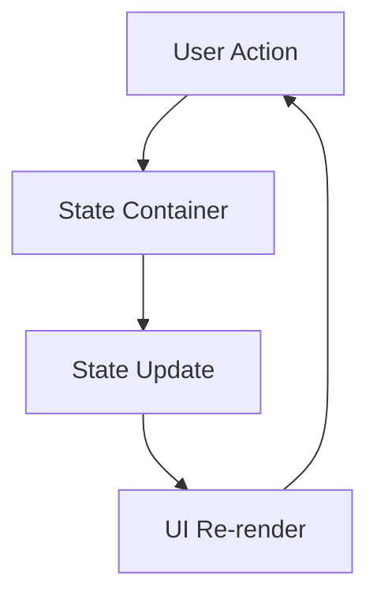

# State Management

Every React developer starts the same way: managing state within components using `useState`. It feels natural, straightforward, and works perfectly for simple cases. But as your application grows, you'll inevitably hit the same walls that every React team encounters.

This guide tells the story of that journey—from the simplicity of component state to the complexity that drives teams toward better solutions, and how BlaC provides a path forward that feels both familiar and powerful.

## The Beginning: Component State That Just Works

Let's start where every React developer begins—with a simple counter:

```tsx
function Counter() {
  const [count, setCount] = useState(0);

  return (
    <div>
      <p>Count: {count}</p>
      <button onClick={() => setCount(count + 1)}>+</button>
      <button onClick={() => setCount(count - 1)}>-</button>
    </div>
  );
}
```

This feels great! State is co-located with the component that uses it. The logic is clear and direct. You can understand the entire component at a glance.

## The First Crack: Sharing State

But then you need to share that counter value with another component. Maybe a header that shows the current count:

```tsx
function App() {
  const [count, setCount] = useState(0); // Lift state up

  return (
    <div>
      <Header count={count} />
      <Counter count={count} setCount={setCount} />
    </div>
  );
}

function Counter({ count, setCount }) {
  return (
    <div>
      <p>Count: {count}</p>
      <button onClick={() => setCount(count + 1)}>+</button>
    </div>
  );
}
```

Still manageable. You've lifted state up to the nearest common ancestor. This is React 101.

## The Pain Begins: Real-World Complexity

But real applications aren't counters. Let's look at a more realistic example—a todo app with user authentication:

```tsx
// ❌ The pain points start to emerge
function TodoApp() {
  const [todos, setTodos] = useState([]);
  const [filter, setFilter] = useState('all');
  const [user, setUser] = useState(null);
  const [isLoading, setIsLoading] = useState(false);
  const [error, setError] = useState(null);

  // Business logic mixed with UI rendering
  const addTodo = async (text) => {
    setIsLoading(true);
    setError(null);

    try {
      const newTodo = {
        id: Date.now(),
        text,
        completed: false,
        userId: user?.id
      };

      // Optimistic update
      setTodos([...todos, newTodo]);

      // Side effects scattered throughout the component
      analytics.track('todo_added', { userId: user?.id });
      await api.saveTodo(newTodo);

      setIsLoading(false);
    } catch (err) {
      // Revert optimistic update
      setTodos(todos);
      setError(err.message);
      setIsLoading(false);
    }
  };

  // More methods that follow the same problematic pattern...
  const toggleTodo = async (id) => { /* ... */ };
  const deleteTodo = async (id) => { /* ... */ };
  const setFilter = (newFilter) => { /* ... */ };

  // Component becomes a massive mixed bag of concerns
  return (
    <div>
      {/* 100+ lines of JSX */}
    </div>
  );
}
```

Sound familiar? You've probably written code like this. And you've probably felt the frustration as it grows.

## The Problems Compound

As your team grows and your app scales, these problems multiply:

### 🎯 **Testing Nightmare**

```tsx
// How do you test addTodo without rendering the entire component?
// How do you mock all the dependencies?
// How do you test edge cases in isolation?
```

### 🔄 **Logic Duplication**

Need the same todo logic in a different view? Copy-paste time:

```tsx
function MobileTodoApp() {
  // Copy all the same useState calls
  // Copy all the same methods
  // Hope you remember to update both when bugs are found
}
```

### 🕳️ **Prop Drilling Hell**

Need that todo state 5 components deep?

```tsx
function App() {
  const [user, setUser] = useState(null);
  return <Layout user={user} setUser={setUser} />;
}

function Layout({ user, setUser }) {
  return <Sidebar user={user} setUser={setUser} />;
}

function Sidebar({ user, setUser }) {
  return <UserProfile user={user} setUser={setUser} />;
}

// Finally...
function UserProfile({ user, setUser }) {
  // Actually uses the props
}
```

### ⚡ **Performance Issues**

Every state change triggers a re-render, even for unrelated UI parts:

```tsx
const [todos, setTodos] = useState([]);
const [filter, setFilter] = useState('all');

// Changing filter re-renders the entire todo list
// Adding a todo re-renders the filter buttons
// Everything is connected to everything
```

### 🤯 **Mental Model Breakdown**

Your components become responsible for:
- Rendering UI
- Managing state
- Handling async operations
- Error management
- Business logic
- Side effects
- Performance optimization

That's too many concerns for any single entity to handle well.

## The Context API: A Partial Solution

Many teams reach for React's Context API to solve prop drilling:

```tsx
const TodoContext = createContext();

function TodoProvider({ children }) {
  const [todos, setTodos] = useState([]);
  // ... all the same problems, now in a provider

  return (
    <TodoContext.Provider value={{ todos, setTodos, addTodo }}>
      {children}
    </TodoContext.Provider>
  );
}
```

This solves prop drilling, but creates new problems:
- **Performance**: Any context change re-renders all consumers
- **Testing**: Still difficult to test logic in isolation
- **Organization**: Logic is still mixed with state management
- **Complexity**: Need multiple contexts to avoid performance issues

## The BlaC Breakthrough: Separation of Concerns

BlaC takes a fundamentally different approach. Instead of trying to fix React's built-in state management, it provides dedicated containers for your business logic:

```typescript
// ✅ Pure business logic, no UI concerns
class TodoCubit extends Cubit<TodoState> {
  constructor(
    private api: TodoAPI,
    private analytics: Analytics
  ) {
    super({
      todos: [],
      filter: 'all',
      isLoading: false,
      error: null
    });
  }

  addTodo = async (text: string) => {
    // Clear, focused responsibility
    this.patch({ isLoading: true, error: null });

    try {
      const newTodo = { id: Date.now(), text, completed: false };

      // Optimistic update
      this.patch({
        todos: [...this.state.todos, newTodo],
        isLoading: false
      });

      // Side effects in the right place
      this.analytics.track('todo_added');
      await this.api.saveTodo(newTodo);

    } catch (error) {
      // Clean error handling
      this.patch({
        error: error.message,
        isLoading: false
      });
    }
  };

  setFilter = (filter: string) => {
    this.patch({ filter });
  };
}
```

```tsx
// ✅ Clean UI component focused on presentation
function TodoApp() {
  const [state, cubit] = useBloc(TodoCubit);

  return (
    <div>
      <TodoForm onSubmit={cubit.addTodo} disabled={state.isLoading} />
      <TodoList todos={state.todos} filter={state.filter} />
      <FilterButtons
        current={state.filter}
        onChange={cubit.setFilter}
      />
      {state.error && <ErrorMessage error={state.error} />}
    </div>
  );
}
```

## Unidirectional Data Flow

BlaC enforces a predictable, one-way data flow:



This pattern makes your application:
- **Predictable**: State changes follow a clear path
- **Debuggable**: You can trace every state change
- **Testable**: Business logic is isolated

## State Update Patterns

### Direct Updates (Cubit)

Cubits provide direct methods for state updates:

```typescript
class CounterCubit extends Cubit<{ count: number }> {
  increment = () => this.emit({ count: this.state.count + 1 });
  decrement = () => this.emit({ count: this.state.count - 1 });
  reset = () => this.emit({ count: 0 });
}
```

### Event-Driven Updates (Bloc)

Blocs use events for more structured updates:

```typescript
class CounterBloc extends Bloc<{ count: number }, CounterEvent> {
  constructor() {
    super({ count: 0 });

    this.on(Increment, (event, emit) => {
      emit({ count: this.state.count + event.amount });
    });

    this.on(Decrement, (event, emit) => {
      emit({ count: this.state.count - event.amount });
    });
  }
}
```

## State Structure Best Practices

### 1. Use Serializable Objects

Always use serializable objects for your state instead of primitives. This ensures compatibility with persistence, debugging tools, and state management patterns:

```typescript
// ❌ Avoid primitive state
class CounterCubit extends Cubit<number> {
  constructor() {
    super(0);
  }
}

// ✅ Use serializable objects
class CounterCubit extends Cubit<{ count: number }> {
  constructor() {
    super({ count: 0 });
  }

  increment = () => this.emit({ count: this.state.count + 1 });
}
```

Benefits of serializable state:
- **Persistence**: Easy to save/restore with `JSON.stringify/parse`
- **Debugging**: Better inspection in DevTools
- **Extensibility**: Add properties without breaking existing code
- **Type Safety**: More explicit about state shape
- **Immutability**: Clearer when creating new state objects

### 2. Keep State Normalized

Instead of nested data, use normalized structures:

```typescript
// ❌ Nested state
interface BadState {
  posts: {
    id: string;
    title: string;
    author: {
      id: string;
      name: string;
      posts: Post[]; // Circular reference!
    };
    comments: Comment[];
  }[];
}

// ✅ Normalized state
interface GoodState {
  posts: Record<string, Post>;
  authors: Record<string, Author>;
  comments: Record<string, Comment>;
  postIds: string[];
}
```

### 2. Separate UI State from Domain State

```typescript
interface TodoState {
  // Domain state
  todos: Todo[];

  // UI state
  filter: 'all' | 'active' | 'completed';
  searchQuery: string;
  isLoading: boolean;
  error: string | null;
}
```

### 3. Use Discriminated Unions for Complex States

```typescript
// ✅ Clear state representations
type AuthState =
  | { status: 'idle' }
  | { status: 'loading' }
  | { status: 'authenticated'; user: User }
  | { status: 'error'; error: string };

class AuthCubit extends Cubit<AuthState> {
  constructor() {
    super({ status: 'idle' });
  }

  login = async (credentials: Credentials) => {
    this.emit({ status: 'loading' });

    try {
      const user = await api.login(credentials);
      this.emit({ status: 'authenticated', user });
    } catch (error) {
      this.emit({ status: 'error', error: error.message });
    }
  };
}
```

## Async State Management

BlaC makes async operations straightforward:

```typescript
class DataCubit extends Cubit<DataState> {
  fetchData = async () => {
    // Set loading state
    this.patch({ isLoading: true, error: null });

    try {
      // Perform async operation
      const data = await api.getData();

      // Update with results
      this.patch({
        data,
        isLoading: false,
        lastFetched: new Date()
      });
    } catch (error) {
      // Handle errors
      this.patch({
        error: error.message,
        isLoading: false
      });
    }
  };
}
```

## State Persistence

Persist state across sessions:

```typescript
class SettingsCubit extends Cubit<Settings> {
  constructor() {
    // Load from storage
    const stored = localStorage.getItem('settings');
    super(stored ? JSON.parse(stored) : defaultSettings);

    // Save on changes
    this.on('StateChange', (state) => {
      localStorage.setItem('settings', JSON.stringify(state));
    });
  }
}
```

## State Composition

Combine multiple state containers:

```typescript
function Dashboard() {
  const [user] = useBloc(UserCubit);
  const [todos] = useBloc(TodoCubit);
  const [notifications] = useBloc(NotificationCubit);

  return (
    <div>
      <Header user={user} notifications={notifications} />
      <TodoList todos={todos} />
    </div>
  );
}
```

## Performance Optimization

BlaC automatically optimizes re-renders:

```typescript
function TodoItem() {
  const [state] = useBloc(TodoCubit);

  // Component only re-renders when accessed properties change
  return <div>{state.todos[0].text}</div>;
}
```

Manual optimization when needed:

```typescript
function ExpensiveComponent() {
  const [state] = useBloc(DataCubit, {
    // Custom equality check
    equals: (a, b) => a.id === b.id
  });

  return <ComplexVisualization data={state} />;
}
```

## Common Patterns

### Optimistic Updates

Update UI immediately, sync with server in background:

```typescript
class TodoCubit extends Cubit<TodoState> {
  toggleTodo = async (id: string) => {
    // Optimistic update
    const todo = this.state.todos.find(t => t.id === id);
    this.patch({
      todos: this.state.todos.map(t =>
        t.id === id ? { ...t, completed: !t.completed } : t
      )
    });

    try {
      // Sync with server
      await api.updateTodo(id, { completed: !todo.completed });
    } catch (error) {
      // Revert on error
      this.patch({
        todos: this.state.todos.map(t =>
          t.id === id ? todo : t
        )
      });
      this.showError('Failed to update todo');
    }
  };
}
```

### Computed State

Derive values instead of storing them:

```typescript
class TodoCubit extends Cubit<TodoState> {
  // Don't store computed values in state
  get completedCount() {
    return this.state.todos.filter(t => t.completed).length;
  }

  get progress() {
    const total = this.state.todos.length;
    return total ? this.completedCount / total : 0;
  }
}
```

### State Machines

Model complex flows as state machines:

```typescript
type PaymentState =
  | { status: 'idle' }
  | { status: 'processing'; amount: number }
  | { status: 'confirming'; transactionId: string }
  | { status: 'success'; receipt: Receipt }
  | { status: 'failed'; error: string };

class PaymentCubit extends Cubit<PaymentState> {
  processPayment = async (amount: number) => {
    // State machine ensures valid transitions
    if (this.state.status !== 'idle') return;

    this.emit({ status: 'processing', amount });
    // ... continue flow
  };
}
```

## Summary

BlaC's state management approach provides:
- **Separation of Concerns**: Business logic stays out of components
- **Predictability**: State changes are explicit and traceable
- **Testability**: State logic can be tested in isolation
- **Performance**: Automatic optimization with manual control when needed
- **Flexibility**: From simple counters to complex state machines

Next, dive deeper into [Cubits](/concepts/cubits) and [Blocs](/concepts/blocs) to master BlaC's state containers.
