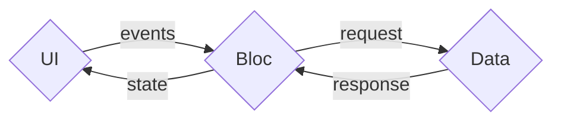

# Architecture

## Bloc Lifecycle
Blac uses classes for a key reason: to enable defining state and business logic without immediate initialization. This approach also allows multiple instances of the same bloc to exist simultaneously.

```ts
class MyBloc extends Cubit<MyState> {
  // ...
}
```

When a bloc is defined, it remains dormant until something subscribes to it. The bloc is initialized and its initial state is set only when the first consumer subscribes.

```tsx
// in plain JS
const unsubscribe = Blac.subscribe(MyBloc); // MyBloc is initialized
unsubscribe(); // MyBloc is disposed of

// in React
function MyComponent() {
  const [state, bloc] = useBloc(MyBloc); // MyBloc is initialized
  // when the component unmounts, MyBloc is disposed of
  // ...
}
```

When the last consumer unsubscribes, the bloc is disposed of unless the `keepAlive` option is set to `true`.

If the `isolated` option is set to `true`, each consumer gets its own instance of the bloc, meaning there will be only one listener on that bloc instance.

::: info Shared Bloc State
By default, all components that use the same bloc will share the same instance of the bloc.
:::

::: info Isolated Bloc State
A bloc with `isolated = true` behaves similarly to state defined inside a component — each component instance will have its own bloc instance.
:::

## Controlled Sharing Groups

Need to share state between specific components but not others? Use custom instance IDs to create controlled sharing groups. Components using the same bloc with the same ID will share state.
```tsx
// Component A and B will share the same instance of MyBloc
function ComponentA() {
  const [state, bloc] = useBloc(MyBloc, {
    id: 'group-01' 
  });
}

function ComponentB() {
  const [state, bloc] = useBloc(MyBloc, {
    id: 'group-01' 
  });
}

// Component C will have its own instance of MyBloc
function ComponentC() {
  const [state, bloc] = useBloc(MyBloc, {
    id: 'group-02' 
  });
}
```

This approach is useful when you have multiple instances of the same feature but need to keep the state of each separate.

For example, you could have a chat application with multiple conversations where each conversation has its own bloc instance.

## Separation of Concerns

Inspired by the BLoC pattern, Blac encourages you to move all business logic out of your UI and into a "Bloc". A Bloc is a unit of business logic responsible for a specific part of your application.

::: warning Blac is not an implementation of the BLoC pattern
Blac does not enforce any specific architecture. It's designed to be flexible and allows you to structure your application in the way that best suits your needs.
:::

This enables you to structure your application in three layers:

- **Presentation Layer**: Renders the UI and handles user events.
- **Business Logic Layer**: Holds the application state and manages mutations.
- **Data Layer**: Fetches and persists data.



### Presentation Layer (UI)

The Presentation Layer is what users see and interact with. It's responsible for displaying the application state and handling user events.

This layer consumes the state from the Business Logic Layer, displays it in the UI, and sends events back to the Business Logic Layer. The UI is sometimes called the "Consumer" of the Business Logic Layer.

In `@blac/react`, this is done through the `useBloc` hook:

```tsx
const { state, send } = useBloc(Bloc);
```

### Business Logic Layer (Bloc)

The Business Logic Layer contains all your application's business logic. It sits between the Presentation Layer and the Data Layer, handling events from the UI, mutating state, and interacting with the Data Layer as needed.

#### Bloc to Bloc Communication

You can access another bloc's state or call its methods using the `Blac.getBloc` function. This only works if the bloc is already initialized and is not set as `isolated`.

```ts
const bloc = Blac.getBloc(MyBloc);
const state = bloc.state;
bloc.someMethod();
```
