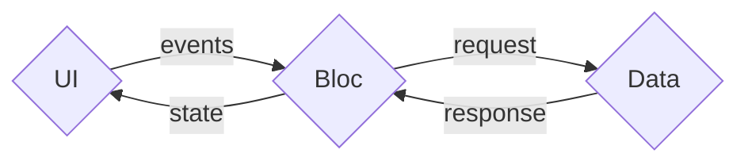

# Architecture

## Bloc Lifecycle
One reason why Blac uses classes, is to enable you to define the state and business logic, without initializing it immediately. It also allows for multiple instances of the same bloc to exist at the same time.

```ts
class MyBloc extends Cubit<MyState> {
  // ...
}
```

When a bloc is defined, nothing happens until something subscribes to it. When the first consumer subscribes, the bloc is initialized and the initial state is set.

```tsx
// in plain JS
const unsubscribe = Blac.subscribe(MyBloc); // MyBloc is initialized
unsubscribe(); // MyBloc is disposed of

// in React
function MyComponent() {
  const [state, bloc] = useBloc(MyBloc); // MyBloc is initialized
  // when the component unmounts, MyBloc is disposed of
  // ...
}
```

When the last consumer unsubscribes, the bloc is disposed of unless the `keepAlive` option is set to `true`.

If the `isolated` option is set to `true`, each consumer gets its own instance of the bloc, that means there will only one listener on the bloc.

::: info Shared Bloc State
By default, all components that use the same bloc will share the same instance of the bloc.
:::

::: info Isolated Bloc State
Bloc with `isolated = true` results in similar behavior as if the state was defined inside the component, each instance of the component will have its own bloc instance.
:::

## Controlled Sharing Groups

Need to share state between specific components but not others? Use custom instance IDs, to create controlled sharing groups. Components using the same bloc with the same ID will share state.
```tsx
// Component A and B will share the same instance of MyBloc
function ComponentA() {
  const [state, bloc] = useBloc(MyBloc, {
    id: 'group-01' 
  });
}

function ComponentB() {
  const [state, bloc] = useBloc(MyBloc, {
    id: 'group-01' 
  });
}

// Component C will have its own instance of MyBloc
function ComponentC() {
  const [state, bloc] = useBloc(MyBloc, {
    id: 'group-02' 
  });
}
```

This can be useful if you have multiple instances of the same feature, but you want to keep the state of each instance separate.

As an example, you could have a chat application with multiple chat conversations where each conversation has its own bloc instance.

## Separation of Concerns

Inspired by the BLoC pattern, Blac incourages you to move all your business logic out of your UI and into a "Bloc". A Bloc is a unit of business logic that is responsible for a part of your application.

::: warning Blac is not a implementation of the BLoC pattern
Blac does not enforce any specific architecture. It is designed to be flexible and allow you to structure your application in the way that best suits your needs.
:::

This allows you to structure your application in three layers:

- **Presentation Layer**: Renders the UI and handles user events.
- **Business Logic Layer**: Holds the application state and mutates it.
- **Data Layer**: Fetches and persists data.



### Presentation Layer (UI)

The Presentation Layer is the part of your application that the user sees and interacts with. It's responsible for displaying the state of the application and handling user events.

The Presentation Layer can consume the state of the Business Logic Layer and display it in a UI and send events to the Business Logic Layer. The UI is sometimes called the "Consumer" of the Business Logic Layer.

In `@blac/react`, this is done through the `useBloc` hook.

```tsx
const { state, send } = useBloc(Bloc);
```

### Business Logic Layer (Bloc)

The Business Logic Layer is the part of your application that contains the business logic. It sits between the Presentation Layer and the Data Layer handling events from the Presentation Layer and mutating the state, loading or sending events to the Data Layer as needed.

#### Bloc to Bloc communication

You can access the state of another bloc, or call its methods by using the `Blac.getBloc` function. This only works if the bloc is already initialized and is not `isolated`.

```ts
const bloc = Blac.getBloc(MyBloc);
const state = bloc.state;
bloc.someMethod();
```
