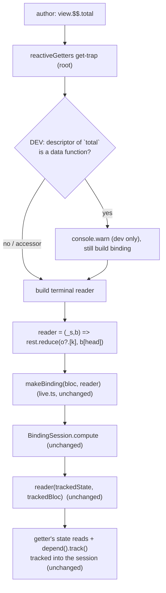

-- COUNCIL REVIEW --
Task: Add a SEPARATE `$$` reactive namespace to `@blac/lit` for derived/getter reads
(`bloc.$$.total ≡ select(bloc, (_s, b) => b.total)`), leaving `$` exactly as-is
(state-only, fully-typed). `$$` never throws; in dev it `console.warn`s when a member
is a function (method) and still returns an inert Binding.

Risks: (1) accidentally invoking a getter while trying to detect method-ness for the
dev-warn (side effects / throwing getters); (2) `$$` binding losing its `bindingMeta`
mirror and breaking `model`/`when`/`each`/`match`/`getBindingMeta`; (3) code
duplication between `reactive` and `reactiveGetters` bloating the bundle past 3 kB
brotli; (4) type surface leaking base-class members (`$$.emit`, `$$.channel`).

Approach: `$$` is pure sugar over the already-proven `select(bloc, (_s,b)=>b.member)`
path. The engine invokes readers with the `trackedBloc` proxy (binding-session.ts:
205-208, track.ts:105-122), so a getter read off `b` records its real state +
cross-bloc `depend().track()` deps — proven in depend.test.ts:79. No classifier, no
dev-throw, no `$` changes. A shared proxy scaffold parameterizes the terminal reader:
`$` reduces over `state`; `$$` reads `head` off the tracked bloc then reduces over the
result. Method-ness is detected purely by property-DESCRIPTOR inspection (accessor vs
data descriptor) — an accessor is identified structurally by `.get` and is NEVER
invoked; only a data descriptor's already-materialized `.value` is `typeof`-checked.

Nancy Leveson: "What's the worst-case failure mode?" A getter fired during the warn
check, causing a side effect or throw before the binding even mounts. Mitigation: the
warn check reads ONLY property descriptors; it never reads `b[head]`, so accessors are
never triggered. Verified by test #9 (throwing/side-effecting getter spy).

Matt Blaze: "What's the security impact?" None. No eval / dynamic import / network.
Descriptor inspection over an object the caller already owns; proto walk bounded at
`Object.prototype`.

Butler Lampson: "Is this the simplest viable approach?" Yes — simpler than the dropped
"unify into `$`" design: no state-vs-getter-vs-missing classifier, no dev-throw path,
`$` untouched. `$$` uniformly evaluates the member off the tracked bloc; a shared
builder keeps it to a few bytes over the existing `reactive()`.

Alan Kay: "Are we solving the right problem?" Yes — authors want ergonomic getter
reads without hand-writing `select(bloc, (_s,b)=>b.x)`, while keeping `$`'s state
guarantees crisp and separate. Two namespaces make the state/derived distinction
explicit rather than magic.

Barbara Liskov: "Does this preserve system integrity?" Yes. `$$` bindings are the same
`Binding<T>` contract with the same `bindingMeta`, substitutable everywhere `$`
bindings are. `$`'s runtime and types are byte-for-byte unchanged.

Decision: Proceed. Scoped, additive, engine untouched; the only subtlety
(method-detection without invoking getters) is resolved structurally.
-- END COUNCIL --

# Architectural Plan: Derived/Getter Reads via a Separate `$$` Namespace (`@blac/lit`)

## Decision
**Approach**: Add a second reactive proxy `bloc.$$` that is sugar for the working
`select(bloc, (_s, b) => b.member)` pattern. `$$.total` builds a `Binding` whose
reader reads `total` off the `trackedBloc` proxy `b`, so the getter records its real
deps (state + cross-bloc `depend().track()`). `$` — state-only, keyed off
`ExtractState<T>` — is left EXACTLY as-is (no runtime, no type, no JSDoc-behavior
change beyond a doc pointer). `$$` NEVER throws; in dev it `console.warn`s when the
accessed member is a function (method) and still returns an inert `Binding`.

This SUPERSEDES the dropped "unify getters into `$`" design: there is NO
`getter-probe.ts` classifier, NO getter/state/missing classification, and NO dev-throw
on `$`. Those parts of the prior plan are deleted.

**Risk Level**: Low (additive; engine and `$` untouched; misuse is graceful).

## Why the engine already supports this (verified ground truth)
- `binding-session.ts:205-208` — the reader runs as
  `reader(tracked.value, trackedBloc(source, tracked.value, this.onDepHandle))`; the
  2nd arg is the tracking bloc proxy.
- `track.ts:105-122` `trackedBloc` — returns the tracking state proxy for `.state`
  and routes branded `depend()` handles through `onDepHandle`. A getter invoked with
  this proxy as receiver (`b.total`) records its real state + cross-bloc deps.
- `depend.test.ts:79` — `select(combined, (_s, b) => b.total)` where `total` reads
  `this.state.x + this.getOther.track()`; driving the OTHER bloc wakes the binding.
  `$$` is exactly this call shape, generated by a proxy.

## Architecture & Data Flow



Why reducing further segments off a getter's return needs NO extra tracking: once
`b[head]` runs, the getter's OWN reads (`this.state.*`, `this.dep.track()`) are already
recorded by `trackedBloc` into the session. The getter returns a PLAIN value (a
computed object/number). `rest.reduce((o,k)=>o?.[k], b[head])` walks that plain value's
fields — reactivity is the SET OF INPUTS the getter consumed, not the shape of its
output — so no additional path tracking is required or wanted.

## Runtime Design (precise)

### Shared proxy scaffold — `packages/blac-lit/src/live.ts`
Factor the existing `reactive()` (live.ts:132-160) into a shared builder parameterized
by a **root reader factory**, so `$` (reduce over `state`) and `$$` (read head off `b`,
reduce over result) share one proxy scaffold — chaining, `.map`, symbol /
`_$litDirective$` / `values` passthrough, and the `bindingMeta`-mirror onto the proxy
(live.ts:156) — with only the terminal reader differing. Sketch:

```ts
type RootReader = (path: string[]) => ReadFn;

// State root: reduce the whole path over `state` (today's behavior, verbatim).
const stateRoot: RootReader = (path) => (s) =>
  path.reduce((o: any, k) => (o == null ? o : o[k]), s);

// Getter root: read head off the tracked bloc, then reduce the rest over the result.
const getterRoot =
  (bloc: StateContainer): RootReader =>
  (path) => {
    const [head, ...rest] = path;
    return (_s, b) =>
      rest.reduce((o: any, k) => (o == null ? o : o[k]), (b as any)[head]);
  };

function makeReactiveProxy(bloc: StateContainer, rootReader: RootReader,
                           onBuild?: (path: string[]) => void): any {
  const build = (path: string[]): any => {
    const binding = path.length ? makeBinding(bloc, rootReader(path)) : undefined;
    const proxy = new Proxy(binding ?? (Object.create(null) as object), {
      get(_t, prop) {
        if (prop === '_$litDirective$' || prop === 'values' ||
            prop === 'map' || typeof prop === 'symbol') {
          return binding ? (binding as any)[prop] : undefined;
        }
        const next = [...path, String(prop)];
        onBuild?.(next);            // $$ hook: dev-warn on method members
        return build(next);
      },
    });
    if (binding) bindingMeta.set(proxy, getBindingMeta(binding));
    return proxy;
  };
  return build([]);
}

export function reactive(bloc: StateContainer): any {
  return makeReactiveProxy(bloc, stateRoot);            // $  — UNCHANGED behavior
}

export function reactiveGetters(bloc: StateContainer): any {
  return makeReactiveProxy(bloc, getterRoot(bloc), (path) => warnIfMethod(bloc, path));
}
```
`makeBinding`, `bind`, `select`, `BindDirective`, `getBindingMeta`, `bindingMeta` are
all unchanged. `reactive()`'s observable behavior is identical — it just routes through
the shared scaffold with `stateRoot`. (If the reviewer prefers, `reactive` may keep its
current inline body and `reactiveGetters` be a near-copy; the shared factory is
recommended for bytes + single source of truth. Author's call at review time.)

### Wire `$$` into the handle — `packages/blac-lit/src/component.ts` (makeHandle, ~74)
```ts
function makeHandle(bloc: StateContainer): any {
  const dollar = reactive(bloc);
  const dollarDollar = reactiveGetters(bloc);
  return new Proxy(bloc, {
    get(target, prop, receiver) {
      if (prop === '$') return dollar;
      if (prop === '$$') return dollarDollar;
      return Reflect.get(target, prop, receiver);
    },
  });
}
```
Import `reactiveGetters` alongside `reactive` from `./live`.

### Misuse behavior (LOCKED): graceful + dev-warn
`$$` NEVER throws.
- **Data field** (e.g. a plain readonly value): yields a valid but STATIC `Binding`
  (its reader reads the field off `b`, which the tracker sees only if it is a state
  field; a non-state data field never changes so the binding never updates). Benign —
  no warn.
- **Method** (function-valued member — class method or arrow-field action): in DEV
  only, `console.warn` that `$$.<name>` is a function and almost certainly a mistake,
  then STILL return the (inert) `Binding`. Prod: no warn, string folds out.

Guard: repo-standard `process.env.NODE_ENV !== 'production'` (matches
StateContainer.ts:166/388/503/538). The warn lives in `warnIfMethod` invoked from the
`onBuild` hook at TERMINAL-ACCESS time (when the author reads `view.$$.foo`):

```ts
function warnIfMethod(bloc: object, path: string[]): void {
  if (process.env.NODE_ENV === 'production') return;
  const head = path[0];
  if (isMethodMember(bloc, head)) {
    console.warn(
      `[@blac/lit] $$.${head} is a function on ${bloc.constructor.name}; ` +
      `$$ is for derived/getter reads, not methods — this binding will not update. ` +
      `Did you mean to call ${head}() in an event handler?`,
    );
  }
}
```

### RESOLVED: detect method-ness WITHOUT invoking getters
The naive check `typeof b[head] === 'function'` would read `b[head]`, invoking any
accessor (getter) — unacceptable (side effects / throws / defeats laziness). Instead
inspect the property DESCRIPTOR, which distinguishes accessors from data properties
structurally and never triggers a `get`:

```ts
/** True iff `prop`'s first descriptor (own → proto chain) is a DATA function.
 *  Accessors (getters) are identified by `.get` and NEVER invoked. */
function isMethodMember(bloc: object, prop: string): boolean {
  let o: object | null = bloc;                 // start at the instance (arrow fields
  while (o && o !== Object.prototype) {         //  are OWN data props on the instance)
    const d = Object.getOwnPropertyDescriptor(o, prop);
    if (d) {
      if (typeof d.get === 'function') return false;   // accessor → getter, never call
      return typeof d.value === 'function';             // data descriptor → cheap typeof
    }
    o = Object.getPrototypeOf(o);
  }
  return false;                                 // absent → not a method (benign)
}
```
Why safe: for an accessor we detect `.get` and return without reading the value — the
getter is NEVER called. For a data descriptor, `d.value` is the ALREADY-MATERIALIZED
property (arrow-field function, plain method inherited on the proto, or a data field);
reading `d.value` invokes nothing. This resolves the "detect method-ness without
invoking getters" question precisely: use `Object.getOwnPropertyDescriptor` + `.get`
structural check, never a value read on an accessor. Cache is optional and not needed
(descriptor lookups are cheap and only run at author sites, in dev only).

### Why no new O(N) recompute
Reader shapes are chosen at `build()` time (render), not per session tick. The
`BindingSession` compute/memo path (binding-session.ts:161-239, `__recomputeProbe`) is
untouched; a `$$` reader is just another `ReadFn`, memoized per-tick exactly like a
state reader. `perf-budget.test.ts` stays green.

## Type Design (best-effort, benign — no correctness stakes)
`$$` never throws, so types are ergonomic hints, not guarantees. Add `$$` to
`BlocView<T>` (live.ts:57-60); `$` type UNCHANGED:
```ts
export type BlocView<T extends StateContainerConstructor> =
  InstanceReadonlyState<T> & {
    readonly $: ReactiveState<ExtractState<T>>;   // UNCHANGED
    readonly $$: ReactiveGetters<T>;              // NEW
  };
```
`ReactiveGetters<T>` surfaces readonly, non-function, non-state, non-base instance
members as `Binding<value>`:
```ts
// readonly-detection: writable prop => IfEquals picks B, readonly => A.
type IfEquals<X, Y, A, B> =
  (<G>() => G extends { [_ in keyof X]: X[_] } ? 1 : 2) extends
  (<G>() => G extends { [_ in keyof Y]: Y[_] } ? 1 : 2) ? A : B;
type ReadonlyKeys<T> = {
  [K in keyof T]-?: IfEquals<
    { [Q in K]: T[K] }, { -readonly [Q in K]: T[K] }, never, K>;
}[keyof T];

// Base surface to hide (emit/channel/state/... from StateContainer/Cubit).
type BaseSurface = keyof StateContainer;

type ReactiveGetters<T extends StateContainerConstructor> = {
  readonly [K in Exclude<
    ReadonlyKeys<InstanceType<T>>,
    keyof ExtractState<T> | BaseSurface
  > as
    // drop functions and [DEP_BRAND]-branded dep handles
    InstanceType<T>[K] extends (...a: any[]) => any ? never :
    InstanceType<T>[K] extends { [DEP_BRAND]: any } ? never : K
  ]: Binding<InstanceType<T>[K]>;
};
```
Refinements used (both requested): (a) exclude `[DEP_BRAND]`-branded dep handles; (b)
readonly-detection via `IfEquals` so only readonly members (get-only getters) surface —
mutable actions / dep handles / writable data fields are dropped. `Omit`/`Exclude` the
base `StateContainer` surface so `$$.channel`/`$$.emit`/`$$.state` don't appear.
Residual edges, documented BENIGN (since `$$` never throws):
- readonly DATA field → false POSITIVE: appears in `$$`, yields a static binding.
- getter+setter pair (writable) → false NEGATIVE: excluded by readonly filter; author
  falls back to `select(...)`.
Keep `ReactiveGetters`/`ReadonlyKeys`/`IfEquals` INTERNAL — do NOT export from
`index.ts`. `DEP_BRAND` is already imported into track.ts from `@blac/core`; import the
type-level brand where the helper lives (live.ts) or re-export as needed.

## Implementation Steps (small, independently reviewable)
1. **[Step 1 — Runtime proxy]** `packages/blac-lit/src/live.ts`: factor
   `makeReactiveProxy(bloc, rootReader, onBuild?)`; refactor `reactive` onto it with
   `stateRoot` (behavior identical); add `reactiveGetters(bloc)` with `getterRoot`.
   Export `reactiveGetters` (module-internal use by component.ts; not from index.ts).
2. **[Step 2 — Wire `$$`]** `packages/blac-lit/src/component.ts` `makeHandle` (~74):
   add the `$$` branch returning `reactiveGetters(bloc)`; import it from `./live`.
3. **[Step 3 — Misuse dev-warn]** In `live.ts`, add `isMethodMember` (descriptor
   probe, never invokes accessors) + `warnIfMethod` behind
   `process.env.NODE_ENV !== 'production'`; wire it as the `onBuild` hook for
   `reactiveGetters` only.
4. **[Step 4 — Types]** In `live.ts`, add `IfEquals`/`ReadonlyKeys`/`ReactiveGetters`
   and `readonly $$: ReactiveGetters<T>` on `BlocView`. `$`/`ReactiveState` untouched.
5. **[Step 5 — Tests]** NEW `packages/blac-lit/src/getter-dollar.test.ts` (cases
   below).
6. **[Step 6 — Docs]** Update `$` JSDoc (live.ts:127-131): change "getters/computed:
   use `select`" to point at `$$`. Note that `packages/blac-lit/MISSING_FEATURES.md`
   §1 + Appendix should change "getters through `$`" → "getters through `$$`" and
   reflect the separate-namespace decision — the COORDINATOR may make this edit; flag
   it here so it isn't missed.

## Files to Change
- `packages/blac-lit/src/live.ts` — shared `makeReactiveProxy` scaffold;
  `reactiveGetters` + `getterRoot`; `isMethodMember` + `warnIfMethod` (dev-guarded);
  `IfEquals`/`ReadonlyKeys`/`ReactiveGetters` types; `$$` on `BlocView`; `$` JSDoc
  pointer. `$` runtime + `ReactiveState` type UNCHANGED.
- `packages/blac-lit/src/component.ts` — `makeHandle` `$$` branch + import.
- `packages/blac-lit/src/getter-dollar.test.ts` — NEW.
- `packages/blac-lit/MISSING_FEATURES.md` — docs update (coordinator may own).
Explicitly NOT changed: `internal/binding-session.ts`, `internal/track.ts`,
`control-flow.ts`, `forms.ts`, `mount.ts`, `@blac/core`, and `$`'s runtime/types.

## Tests to Write — `getter-dollar.test.ts` (impl authors; orchestrator runs)
Harness: `import { describe, it, expect } from 'vite-plus/test'`;
`import { flush } from '@blac/core/testing'`; mount + happy-dom `div`; mirror
reactive.test.ts / depend.test.ts.
1. `$$.getter` reactive on its own state deps (drive bloc → binding updates).
2. `$$.getter` reading cross-bloc `depend().track()` wakes when the OTHER registry
   instance changes (mirror depend.test.ts acquire harness, bind via `$$`).
3. Chaining `$$.summaryObj.count` (getter returns an object; nested field reactive).
4. `.map` on a `$$` binding renders + updates.
5. `when` / `each` / `match` fed a `$$` binding resolve via `getBindingMeta` without
   throwing (proxy meta-mirror preserved).
6. `$$` on a data field → static binding: no throw, no update on unrelated changes.
7. Dev-warn: `NODE_ENV='development'` (save/restore like
   StateContainer.meta.test.ts:155-165) — `$$.<method>` `console.warn`s (spy);
   `NODE_ENV='production'` — no warn.
8. `$` state reads unchanged (regression; reuse reactive.test.ts patterns).
9. Getter NEVER invoked during the warn path — spy on a throwing/side-effecting getter;
   accessing `view.$$.throwingGetter` to BUILD the binding must not fire it (only
   mounting/reading it does). Guards `isMethodMember`'s descriptor-only check.
Perf: assert no new O(N) recompute via `__recomputeProbe` around a single `$$` update
and confirm `perf-budget.test.ts` stays green.

## Acceptance Criteria
- [ ] `$`'s runtime and `ReactiveState`/`BlocView.$` types are byte-for-byte unchanged.
- [ ] `bloc.$$.<getter>` returns a `Binding` reactive on the getter's own state deps.
- [ ] `bloc.$$.<getter>` wakes on a cross-bloc `depend().track()` target change.
- [ ] `bloc.$$.<getter>.<field>` (chaining) reads nested value and stays reactive.
- [ ] `.map`/`when`/`each`/`match`/`model`/`getBindingMeta` accept `$$` bindings.
- [ ] `$$` NEVER throws (data field → inert binding; method → inert binding + dev-warn).
- [ ] Dev-warn fires for `$$.<method>`; prod does not warn and folds the string out.
- [ ] The dev-warn check NEVER invokes a getter (test #9).
- [ ] Types: `$$.<readonly getter>` is `Binding<value>`; base surface/actions/dep
      handles hidden (best-effort, benign edges documented).
- [ ] `perf-budget.test.ts` green; `@blac/lit` under the 3 kB brotli size-limit.

## Byte-delta estimate (3 kB brotli budget)
Additive runtime: `getterRoot` (~1 line reader), the shared `makeReactiveProxy`
refactor is net-neutral-to-slightly-negative (it de-duplicates `reactive`), the
`component.ts` `$$` branch (~2 lines), and `isMethodMember`/`warnIfMethod`. The warn
string + `warnIfMethod` body sit behind `process.env.NODE_ENV !== 'production'` and
constant-fold OUT of prod bundles. `isMethodMember` (~8 lines) is the main prod
addition. Types are erased. Estimated prod brotli delta: ~120-200 bytes; the shared
scaffold offsets much of it. Orchestrator confirms with `size-limit`; expect to stay
comfortably under 3 kB.

## Risks & Mitigations
- **Risk**: warn check invokes a getter (side effect/throw). **Mitigation**:
  `isMethodMember` inspects descriptors and returns on `.get` WITHOUT reading the
  value; only data descriptors' materialized `.value` are typeof-checked. Test #9.
- **Risk**: `$$` binding loses `bindingMeta` → `model`/`when`/`each`/`match` throw.
  **Mitigation**: the shared scaffold reuses the exact proxy meta-mirror (live.ts:156).
  Test #5.
- **Risk**: refactor changes `$` behavior. **Mitigation**: `reactive` routes through
  the shared scaffold with `stateRoot` = today's `(s)=>path.reduce(...)`; regression
  test #8 + reactive.test.ts stay green. If review prefers zero risk to `$`, keep
  `reactive`'s inline body and duplicate a minimal `reactiveGetters` (small byte cost).
- **Risk**: type surface leaks base members / false edges. **Mitigation**: `Exclude`
  base `StateContainer` surface + readonly filter + `[DEP_BRAND]` drop; residual edges
  are benign because `$$` never throws (documented).
- **Risk**: new per-render O(N) recompute. **Mitigation**: reader shape chosen at build
  time; session/memo untouched; `perf-budget.test.ts` + `__recomputeProbe` gate.

## Open Questions / Assumptions
- **Method-detection without invoking getters** (RESOLVED): descriptor inspection via
  `Object.getOwnPropertyDescriptor` walking instance-own → proto chain; accessors
  detected by `.get` and never invoked; only data descriptors' `.value` typeof-checked.
- **Shared factory vs two proxies** (author's call at review): recommended shared
  `makeReactiveProxy` for bytes + single source of truth; a minimal duplicate is an
  acceptable fallback if reviewers want `$`'s body literally untouched.
- **Open**: warn once-per-(class,member) vs every access? Plan warns every access
  (simpler, dev-only); a per-constructor `Set` dedupe is a trivial add if noisy.
- **Open**: `MISSING_FEATURES.md` edit ownership — coordinator indicated they may make
  it; flagged in Step 6 so it isn't dropped.
