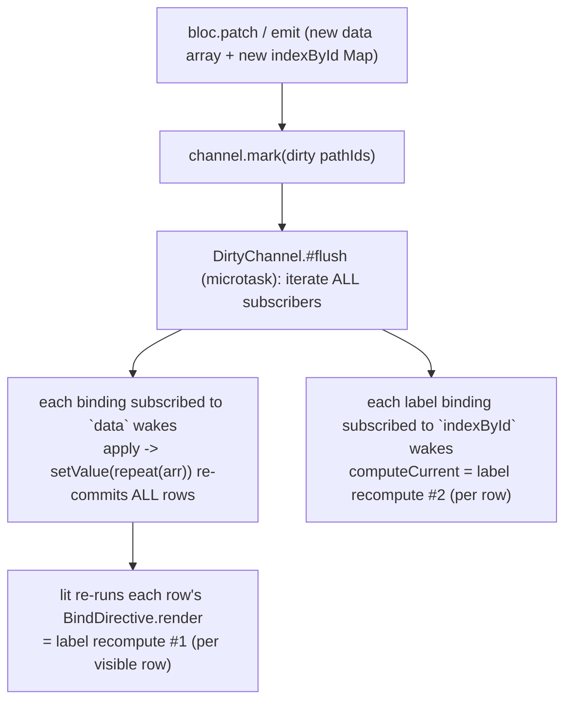
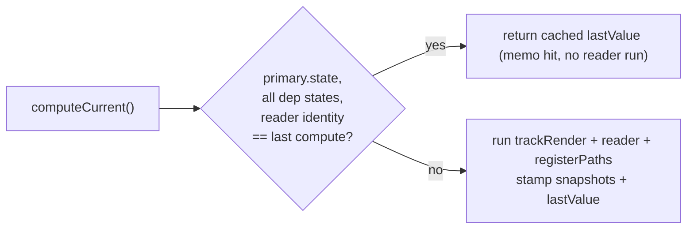

# Architectural Plan: Eliminate CPU Recompute Fan-out in `@blac/lit` Reactive Binding Layer

-- COUNCIL REVIEW --
Task: Design a phased, alternatives-aware plan to remove the O(N)-per-op selector
recompute fan-out in `@blac/lit` (double-compute + whole-Map leaf + shared-scalar
`selected`), verified against the js-framework-benchmark demo, without breaking the
deliberate opaque-leaf semantics of `@dirtytalk/structural`.

Risks: A tracker change to make `Map` per-key trackable can break receiver-checked
built-ins (`Map.prototype.get` "called on incompatible receiver"), silently corrupt
the diff skeleton, and regress a shared core package used by `@blac/core` and
`@blac/react`. A memoization guard in `BindingSession` can wrongly suppress a
recompute when a *cross-bloc dep* changes but the primary state did not.

Approach: Land the pure-library, universal, low-risk win first (double-compute
de-dupe in `BindingSession`). Treat the Map and `selected` fan-out as data-model
problems solved by the tracker's EXISTING plain-object per-key leaf tracking, not by
mutating opaque-leaf semantics. Verdict on per-key Map tracking is: feasible but not
worth the blast radius now.

Nancy Leveson: "What's the worst-case failure mode?" — A memo guard that skips a
needed recompute -> stale DOM. Mitigated by keying the memo on ALL tracked container
snapshots (primary + every dep) AND reader identity, with a cross-bloc regression
test. A tracker Map change that throws on a receiver-checked built-in -> hard crash;
avoided by not shipping the tracker change.

Matt Blaze: "What's the security impact?" — None material; no new data boundaries,
network surface, or trust changes. Purely in-process rendering/CPU.

Butler Lampson: "Is this the simplest viable approach?" — Yes. Phase 1 is a
localized memo. Phases 2-3 are demo data-model normalizations that reuse an existing
library primitive (plain-object per-key leaves). We explicitly reject the complex
per-key Map tracker rewrite.

Alan Kay: "Are we solving the right problem?" — Yes. The real problem is "a
single-row op wakes O(N) bindings." Two of the three causes are data-model choices
(Map index + shared scalar) that defeat a mechanism the library already provides;
one is a genuine library bug (double-compute).

Barbara Liskov: "Does this preserve system integrity?" — Phase 1 preserves the
subscribe/register/diff contracts (it only elides a redundant recompute against an
already-seen state). Phases 2-3 change only demo state shape. `@dirtytalk/structural`
invariants are untouched.

Decision: Proceed. Phase 1 (library double-compute de-dupe) first; Phases 2-3
(data-model normalization in the demo) next; per-key Map tracker deferred as a
future opt-in enhancement, not implemented.
-- END COUNCIL --

## Decision
**Approach**: Three independent, additive phases, landed in risk order.
1. **Phase 1 (library, HIGHEST leverage / LOWEST risk):** Kill the double-compute in
   `BindingSession` with a per-tick compute memo keyed on `(all tracked container
   snapshots, reader identity)`. Turns `2N -> N` real recomputes on every data op for
   every binding, component-wrapped or not. No public API change.
2. **Phase 2 (demo data-model):** Replace the reactive `indexById: Map` with a plain-
   object dictionary `byId: Record<number, DataItem>` so per-row label bindings pin a
   precise leaf (`byId.<id>.label`) instead of the whole-Map reference. Uses the
   tracker's EXISTING plain-object per-key leaf tracking. `N -> O(rows actually
   changed)`. No library change.
3. **Phase 3 (demo data-model):** Represent selection as a per-id flag
   (`byId.<id>.selected`) so `select(id)` wakes at most 2 rows instead of N. No
   library change.

**Verdict on per-key `Map`/`Set` tracking in `@dirtytalk/structural`:** Technically
feasible (bind the built-in method to the RAW target inside a recording wrapper so
the receiver check never sees the proxy), but NOT recommended now — it forces a
matching per-key `Map` diff (`getAtSegments` is bracket-access only and cannot read a
`Map`), a non-primitive-key fallback, recursive value wrapping, size/iteration
pinning, and changes documented-deliberate leaf semantics in a shared core package.
The same performance goal is reached with zero library risk by Phase 2.

**Risk Level**: Phase 1 Low. Phase 2 Low. Phase 3 Low. (Deferred Map-tracker option: High.)

## Architecture & Data Flow

### How a wake happens today (unchanged by this plan)

`labelRecomputes = 2 x rows` per data op is the double-compute (recompute #1 from the
`each` re-commit + recompute #2 from the binding's own subscription). Every label
binding pins the single `indexById` path (Map is an opaque leaf), so rebuilding the
Map every op wakes all rows; every `<tr>` class binding pins the shared `selected`
scalar, so `select(id)` wakes all rows.

### Phase 1 — double-compute de-dupe (library)
`BindingSession.computeCurrent()` (`binding-session.ts:132-185`) is the single funnel
for every recompute, invoked from two paths:
- the render path `compute()` (`:87-107`), re-run when `each`/`repeat` re-commits a
  row (lit re-invokes `BindDirective.render` -> `session.compute`), and
- the subscription callback `() => this.apply(this.computeCurrent())`
  (`attachContainer`, `:352-355`).

In one flush both fire against the SAME new state snapshot. Whichever runs first does
the real work and stamps `primary.snapshot` (`:175`); the second currently repeats the
full `trackRender` + selector + `expandWithAncestors` + `registerConsumerPaths` pass
for an identical result.

Mechanism: memoize `computeCurrent` on the identity of every input it reads:
- `primary.container.state` (already captured as `primary.snapshot`),
- each dep record's `container.state` (add a `snapshot` capture per dep — the field
  already exists on `ContainerRecord`, `:48`),
- the current `reader` identity (`this.reader`, `:105`).

If all match the last successful compute, return the cached value WITHOUT re-running
the reader or re-touching registration (paths are provably unchanged because no
tracked state and no reader changed). This makes the redundant second invocation a
near-zero-cost memo hit. Correctness for cross-bloc deps is guaranteed by keying on
EVERY tracked container's snapshot, not just the primary's — a dep-only change breaks
the key and forces a real recompute.



Alternative for Phase 1 (evaluated, see Alternatives): have `ComponentDirective`
return `noChange` instead of the cached `this.result` (`component.ts:172`) so lit
skips re-committing an unchanged-identity row entirely. Narrower blast radius but
only helps `component()`-wrapped items; the memo helps every binding. Recommend the
memo as the primary fix; `noChange` is an optional complementary optimization
(Phase 1b) that additionally trims the `repeat` re-walk allocation.

### Phase 2 — precise per-row label deps (demo data-model)
The tracker already records per-key LEAF paths for plain objects/arrays
(`tracker.ts:436-464`, "leaf-only maximal recording"), and the diff already reads
them via bracket access (`diff.ts` `getAtSegments`, `cursor[segment]`). A `Map`
defeats both: it is an opaque leaf in the tracker (`isStructurallyWrappable`,
`tracker.ts:143-147`) AND unreadable by `getAtSegments` (bracket access on a Map
yields `undefined`). Switching the reactive index from a `Map` to a plain-object
dictionary makes per-key tracking work with NO library change:

State shape change (`benchmark.bloc.ts`):
```
// before: { data: DataItem[], indexById: Map<number,number>, selected: number|null }
// after:  { order: number[], byId: Record<number, DataItem>, selected: number|null }
```
Row label selector (`benchmark.ui.ts:56-59`) becomes `s => s.byId[id]?.label`,
recording the precise leaf `byId.<id>.label`. `updateEveryTenth` marks only the
changed ids' `byId.<id>.label` paths -> only those rows wake. `swapRows` reorders
`order` only (byId entries unchanged) -> zero label wakes. The outer `each`
(`benchmark.ui.ts:157-161`) reads `s => s.order`; when `order`'s reference is stable
(update), the `each` does not wake at all -> no `repeat` re-walk.

### Phase 3 — O(1) selection (demo data-model)
Every `<tr>` class binding pins the shared scalar `selected`, so `select(id)`
(`benchmark.bloc.ts:42-44`) wakes all N class bindings — each runs a full (if cheap)
`computeCurrent`. No tracker change can fix a genuinely shared scalar. Move selection
into a per-id leaf: `byId.<id>.selected: boolean`. `select(id)` flips two entries
(old -> false, new -> true), marking exactly `byId.<old>.selected` and
`byId.<new>.selected`; the class binding reads `s => s.byId[id]?.selected`. Wakes drop
from N to 2. This reuses the same per-key plain-object mechanism as Phase 2 — no
library API or helper is warranted; it is a modeling pattern to document.

## Implementation Steps
1. **Phase 1 — double-compute memo (`binding-session.ts`)** — Prerequisite: none.
   - Add `private lastValue?: T`, `private lastReader?: Reader<T>`, and capture a
     `snapshot` on each dep `ContainerRecord` at compute time.
   - At the top of `computeCurrent()` (`:132`), short-circuit: if `this.reader ===
     lastReader`, `primary.container.state === primary.snapshot`, and every dep
     record's `container.state === rec.snapshot`, return `lastValue`.
   - On a real compute, stamp `lastReader`, `primary.snapshot`, each dep's `snapshot`,
     and `lastValue` before returning.
   - Invalidate the memo on `detachAll` / primary swap (`compute()`, `:87-103`) and on
     `disconnect()` (`:127-130`) by clearing `lastValue`/`lastReader`/snapshots.
   - Leave `attach()`'s gap-close recompute (`:322-324`) intact — it will naturally
     recompute because `state !== snapshot` there.
   - (Optional Phase 1b) In `component.ts`, import `noChange` from `lit-html` (`:1`)
     and return it instead of `this.result` at `:172` when identity is unchanged.
2. **Phase 2 — normalize label deps (`benchmark.bloc.ts`, `benchmark.ui.ts`)** —
   - Replace `withIndex`/`indexById` (`benchmark.bloc.ts:10-14`) with a `byId` builder
     and an `order: number[]`. Update `run`/`runLots`/`add`/`updateEveryTenth`/
     `remove`/`clear`/`swapRows` (`:21-69`) to keep `order`'s reference STABLE when the
     id order does not change (update) and to mutate `byId` immutably per changed id.
   - Row label selector -> `s => s.byId[id]?.label` (`benchmark.ui.ts:56-59`); outer
     `each` source -> `s => s.order` with `renderItem = id => BenchmarkRow({ id })`
     and `keyFn = id => id` (`:157-161`).
3. **Phase 3 — per-id selection (`benchmark.bloc.ts`, `benchmark.ui.ts`)** —
   - Add `selected: boolean` to each `byId` entry; `select(id)` flips old/new entries
     immutably (`benchmark.bloc.ts:42-44`); drop the top-level `selected` scalar (or
     keep it non-reactive for logic only).
   - Class binding -> `s => (s.byId[id]?.selected ? 'selected' : '')`
     (`benchmark.ui.ts:49-51`).
4. **Verification & rollout** — Add recompute-count instrumentation + a perf-budget
   vitest; validate each phase independently via the counter, the demo HUD, and the
   DOM-op trace methodology from the report.

## Files to Change
- `packages/blac-lit/src/internal/binding-session.ts` — Phase 1: memo fields + guard in
  `computeCurrent()` (`:132-185`), snapshot capture in `reconcileDeps`/`attachContainer`
  (`:266-356`), invalidation in `compute()`/`disconnect()`.
- `packages/blac-lit/src/component.ts` — Phase 1b (optional): return `noChange` for
  unchanged identity (`:172`), import `noChange` (`:1`).
- `apps/lit-demo/src/benchmark/benchmark.bloc.ts` — Phases 2 & 3: state shape
  (`:4-14`), all ops (`:21-69`).
- `apps/lit-demo/src/benchmark/benchmark.ui.ts` — Phases 2 & 3: row selectors
  (`:49-59`), `each` source (`:157-161`).
- `packages/blac-lit/src/perf-budget.test.ts` — NEW: single-row-op recompute-budget
  assertions (all phases).
- (Instrumentation) `packages/blac-lit/src/internal/binding-session.ts` — a test-only
  module counter incremented on a real (non-memoized) `computeCurrent`, exported via an
  `@internal` hook for the perf-budget test to read/reset.

Explicitly NOT changed: `packages/dirtytalk-structural/*` (tracker/diff/path-set) and
`packages/dirtytalk-engine/*`. This is the key blast-radius containment of the plan.

## Test Changes
- **New** `packages/blac-lit/src/perf-budget.test.ts`: mount a table of N rows; after
  each op assert real (non-memoized) recomputes are within budget:
  - Phase 1 gate: `updateEveryTenth`/`swap`/`remove` recomputes `== N` (not `2N`).
  - Phase 2 gate: `updateEveryTenth` recomputes `== rowsChanged`; `swap`/`remove`
    label recomputes `== 0`.
  - Phase 3 gate: `select(id)` class recomputes `<= 2`.
- `packages/blac-lit/src/reactive.test.ts`: add a case asserting a binding recommitted
  twice within one tick against one state recomputes ONCE (memo hit).
- `packages/blac-lit/src/depend.test.ts`: add the critical correctness case — a
  cross-bloc dep changing while the primary state is unchanged MUST still recompute
  (guards against a too-broad memo key). Re-run existing depend cases unchanged.
- `packages/blac-lit/src/leak.test.ts`, `component.test.ts`: expected to pass
  unchanged (memo + `noChange` do not alter mount/teardown ref accounting); re-run as
  regression.
- `packages/dirtytalk-structural/*` tests: NOT touched and NOT expected to change —
  confirming the tracker is untouched.

## Verification Method (per phase, independent)
- **Recompute-count instrumentation** (primary signal): the `@internal` counter in
  `BindingSession` gives an exact per-op real-recompute count in vitest — the same
  metric as the report's DOM-op trace, but deterministic.
- **Demo HUD**: `apps/lit-demo` benchmark table logs `bodyExecs` / `patches` deltas
  (`benchmark.ui.ts:77-82`, `dev/devStats.ts`); Phase 1 should not change `bodyExecs`
  (identity unchanged) and should cut end-to-end time roughly in half on data ops.
- **DOM-op trace**: re-run the report's methodology (`pulse` mutation-type log) at
  N=100 to confirm real DOM writes stay minimal and recompute counts match the table
  below.
- Targeted run only (do not run repo-wide): `vp run test packages/blac-lit`, and
  `vp run format:check` + typecheck/lint on the touched files before commit.

## Expected Results (recompute counts, N=100 repro scale)
`label` = per-row label-selector real recomputes; `class` = per-row `<tr>`
class-binding real recomputes. Baseline row = measured trace (report). class column is
modeled (the trace measured labels; class fan-out for `select` is ~N).

| Op (N=100) | Baseline label / class | After P1 label / class | After P2 label / class | After P3 label / class |
|---|---|---|---|---|
| updateEveryTenth (10 change) | 200 / 0 | 100 / 0 | 10 / 0 | 10 / 0 |
| swapRows (2 move) | 200 / 0 | 100 / 0 | 0 / 0 | 0 / 0 |
| select(id) | 0 / ~100 | 0 / ~100 | 0 / ~100 | 0 / 2 |
| remove(id) | 198 / 0 | 99 / 0 | 0 / 0 | 0 / 0 |

Reduction summary: **P1 alone** halves every data-op cost (`2N -> N`) and is the
single biggest, lowest-risk win. **P1+P2** takes data ops from `N -> O(rows changed)`
(swap/remove -> ~0 label wakes; update -> only changed rows). **P1+P2+P3** takes
`select` from `O(N) -> O(1)`. Real DOM writes stay minimal throughout (lit dedup /
`noChange`), as in the baseline.

## Sequencing (recommended)
Land **Phase 1 first** (pure library, universal, lowest risk, biggest single win;
independently verifiable by the recompute counter and HUD timing). Then **Phase 2**
(largest remaining fan-out, zero library risk, proves the plain-object per-key
mechanism). Then **Phase 3** (finishes `select`). Each phase is independently
verifiable and independently revertable. Do NOT start the per-key Map tracker; file it
as a future opt-in enhancement only if a real user need for reactive `Map` state
emerges.

## Alternatives Considered
- **Phase 1 via `ComponentDirective` `noChange` (option B):** one-line, narrow, also
  trims the `repeat` re-walk, but only helps `component()`-wrapped items and depends on
  lit `repeat` handling `noChange` for moved parts. Kept as optional Phase 1b; the memo
  is the primary because it fixes double-compute for ALL bindings at the reactive core.
- **Per-key `Map` tracking in `@dirtytalk/structural` (option a, DEFERRED):** feasible
  by returning `target.get.bind(target)` wrapped in a recording closure (the built-in
  runs on the raw receiver, so no "incompatible receiver" throw) and recording
  `indexById.<key>`. But it also requires: `getAtSegments` Map-awareness in `diff.ts`
  (bracket access can't read a Map); a per-key Map diff with add/delete/size handling;
  a fallback to whole-Map leaf for non-primitive keys (object keys have no stable path
  segment); recursive wrapping of object values returned from `.get`; and pinning the
  whole-map path for `forEach`/`entries`/`keys`/`values`/`size`. High complexity in a
  shared package (`@blac/core`, `@blac/react` depend on it) that changes documented-
  deliberate leaf semantics. Rejected in favor of Phase 2's zero-risk data-model fix.
- **Hybrid (option c):** ship Phase 2 now; document "reactive dictionaries should be
  plain objects, not `Map`s" as the pattern; revisit the tracker enhancement behind an
  opt-in wrapper/flag only on demonstrated demand. This is the recommended posture.

## Risks & Mitigations
- **Risk**: Phase 1 memo suppresses a needed recompute when a cross-bloc dep changed
  but the primary did not. -> **Mitigation**: key the memo on EVERY tracked container's
  snapshot (primary + all deps) plus reader identity; add the `depend.test.ts`
  dep-only-change regression case.
- **Risk**: Phase 1 memo goes stale across primary swap / disconnect-reconnect. ->
  **Mitigation**: invalidate `lastValue`/`lastReader`/snapshots in `compute()` primary-
  swap branch and in `disconnect()`; rely on `attach()`'s existing `state !== snapshot`
  gap-close for reconnection.
- **Risk**: Phase 1b `noChange` interferes with `repeat` moved-part reconciliation. ->
  **Mitigation**: keep it optional and gated behind the same identity check already
  proven by `component.test.ts`; verify with a swap test that moved rows keep content.
- **Risk**: Phase 2/3 immutable-update bugs (e.g. rebuilding `order` when it should be
  stable) silently re-introduce fan-out. -> **Mitigation**: the perf-budget test's
  `swap label == 0` / `update label == rowsChanged` gates catch exactly this
  regression class.
- **Risk**: recompute-count instrumentation ships in production bundle / affects
  size-limit. -> **Mitigation**: guard the counter behind an `@internal` test-only hook
  with no cost on the hot path (a single monotonic increment) and confirm size-limit is
  unaffected.
```
