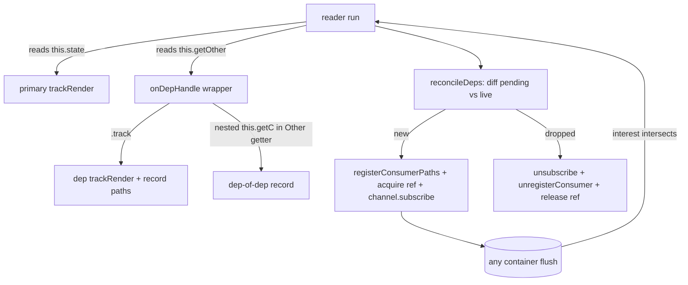

-- COUNCIL REVIEW --
Task: Design (a) a correctness fix so cross-bloc `this.depend(Other).track()`
reads wake Lit bindings, and (b) two profile-gated perf changes (per-container
subscriber hub; per-row `each` selector) for `@blac/lit`.
Risks: A multi-container tracking session can leak registry refs / channel
subscriptions on abandoned renders or partial failures; a dep subscribed but not
ref-held could read a disposed instance; a hub that unions interest can wake
every member on any change (worse than status quo); an `each` row-selector can
double-subscribe.
Approach: Port the *proven* React pattern (`buildTrackedProxy` + `makeDepWrapper`
+ reconcile) into `BindingSession`, exploiting Lit's synchronous single-phase
read to collapse React's render/commit split. Keep the primary source ref-free
(caller owns it) and make the session own only dep refs, released symmetrically.
Gate both perf items behind measurement in `apps/lit-demo`.

Nancy Leveson: "What's the worst-case failure mode?" — A dep is subscribed and
its paths registered, but its ref is never released → registry `refs` Map grows
unbounded and trips `assertRefLimit` (exactly the signal `leak.test.ts` guards).
Mitigation: every dep ref is taken only in the connected `attachContainer` path
and released in `detachContainer`/`detachAll`, mirrored 1:1; abandoned
(never-connected) renders record deps but never acquire.

Matt Blaze: "What's the security impact?" — None new; detection is by the
existing `DEP_BRAND` symbol, no new global surface, no serialization, no network.
The proxy only redirects reads that already occur on the bloc.

Butler Lampson: "Is this the simplest viable approach?" — For P0-2, yes: it is
the minimal generalization of the existing single-source session to N containers,
reusing `trackRender`/`expandWithAncestors`/`registerConsumerPaths` unchanged.
P1-1/P1-2 are explicitly deferred behind profiling so we do not add a hub the
channel may already make unnecessary.

Alan Kay: "Are we solving the right problem?" — P0-2 is the only remaining bug
that renders *silently wrong* output; it must ship. P1-1/P1-2 are latency, not
correctness — right to separate and gate.

Barbara Liskov: "Does this preserve system integrity?" — Yes: `trackedBloc`
stays a read-only proxy, the core `depend()` contract is untouched, and the
session's invariant (registered ⇔ subscribed ⇔ (dep ⇒ ref-held)) is enforced
per-container with the same transactional rollback already used for the primary.

Decision: Proceed. Ship CA-P0-2 first as the must-do correctness fix; hold
CA-P1-1 and CA-P1-2 behind the profiling steps described below.
-- END COUNCIL --

# Architectural Plan: blac-lit cross-bloc tracking + `each`/fan-out perf

## Decision
**Approach**: Generalize `BindingSession` from a single source to a
**multi-container** session. Route branded `depend()` handles read inside a
tracked getter through an `onDepHandle` callback (mirroring
`blac-react/src/buildTrackedProxy.ts:60-76`); the returned wrapper's `.track()`
records the dep container + the paths touched into the session, and the session
reconciles register/subscribe/ref-acquire per dep on every compute — the Lit
analog of React's `makeDepWrapper` + layout-effect reconcile
(`blac-react/src/useBloc.ts:788-877,588-641`). CA-P1-1 (subscriber hub) and
CA-P1-2 (`each` row selector) are designed but **profile-gated**.

**Risk Level**: Medium (CA-P0-2 touches the shared reactive core of every
binding; the fix is a superset of current behavior with equal-or-tighter
teardown, and is covered by the existing `leak.test.ts` baselines plus new
`depend` tests).

## Architecture & Data Flow

### Current (single container)
`BindingSession` owns exactly one `source`: it `trackRender`s the source state,
runs the reader with `trackedBloc(source, trackedState)` (which only intercepts
`state`), registers the touched leaf paths, and holds one `channel.subscribe`.
A `.track()` on a cross-bloc handle read inside a getter falls straight through
`Reflect.get` and returns live `[state, instance]` with **no** subscription — so
the hole never updates when only the dependency changes.

### Target (multi container)


Invariant per container record: `registered ⇔ subscribed`, and for a **dep**
record additionally `subscribed ⇔ ref-held`. The **primary** source is never
ref-acquired by the session — the caller (`select(bloc,…)` argument, or
`ComponentDirective`'s `ctx.use`) owns its lifetime. Deps are discovered
internally, kept alive only by `ensure` (no ref) from `depend()`, so the session
**must** own their refs — this is the deliberate asymmetry, matching React
(`useBloc.ts:834-838` ensures in render, `:620-627` acquires the ref only on
commit).

Lit simplification vs React: the reader runs **synchronously** with no separate
commit phase, so there is no abandoned-render ref-leak window *during a connected
compute* — but a **disconnected** render (`render()` while `!isConnected`) is the
Lit analog of an uncommitted render. We therefore record deps during any compute
but **only acquire refs / subscribe when connected** (in `attach()` or in
`reconcileDeps` when already subscribed). A render that never connects records
dep entries with `acquired:false` and leaks nothing.

## Implementation Steps

### 1. CA-P0-2 — cross-bloc `depend().track()` wakes bindings  ⟵ MUST DO, FIRST

#### 1a. Extend `packages/blac-lit/src/internal/track.ts`
Add dep detection + a union helper, and thread `onDepHandle` through
`trackedBloc` (currently `track.ts:87-97`). Import `DEP_BRAND` from `@blac/core`
(re-exported alongside the other symbols — verified exported at
`packages/blac-core/src/core/StateContainer.ts:26`).

```ts
import { DEP_BRAND } from '@blac/core';

/** A value is a branded depend() handle. Detection is by symbol only. */
export function isDepHandle(v: unknown): v is object {
  return (
    v !== null &&
    (typeof v === 'object' || typeof v === 'function') &&
    (v as Record<symbol, unknown>)[DEP_BRAND] !== undefined
  );
}

/** Union two PathSets (ALL_PATHS dominates). Mirror of useBloc.ts unionPaths. */
export function unionPaths(a: PathSet, b: PathSet): PathSet {
  if (a === ALL_PATHS || b === ALL_PATHS) return ALL_PATHS;
  const out = new Set<number>(a as Set<number>);
  for (const id of b as Set<number>) out.add(id);
  return out;
}

export function trackedBloc<B extends object>(
  bloc: B,
  trackedState: unknown,
  onDepHandle?: (handle: object) => unknown,   // NEW
): B {
  return new Proxy(bloc, {
    get(target, prop, receiver) {
      if (prop === 'state') return trackedState;
      const value = Reflect.get(target, prop, receiver);
      // A branded dep handle read off `this` (e.g. `this.getOther`) is routed
      // through onDepHandle so the current binding's session can wrap .track().
      if (onDepHandle !== undefined && isDepHandle(value)) {
        return onDepHandle(value as object);
      }
      return value;
    },
  }) as B;
}
```
Export `DEP_BRAND`, `isDepHandle`, `unionPaths` from the bottom of `track.ts`
next to the existing re-exports (line 99).

#### 1b. Rewrite `packages/blac-lit/src/internal/binding-session.ts` as multi-container
Replace the flat `source/unsubscribe/registered/paths/interest/snapshot` fields
with one **record per container** and a `deps` map. Sketch (new fields + core
methods; names deliberately parallel the current ones):

```ts
import { getRegistry, type StateContainer, type StateContainerConstructor }
  from '@blac/core';
import {
  asTrackable, emptyPathSet, expandWithAncestors, unionPaths, isDepHandle,
  ProxyCache, trackRender, trackedBloc, type PathSet,
} from './track';

let refCounter = 0;
const nextRefId = () => `blac-lit-dep@${(refCounter += 1)}`;

interface ContainerRecord {
  readonly container: StateContainer;
  readonly kind: 'primary' | 'dep';
  cache: ProxyCache;
  paths: PathSet;
  interest: PathSet;
  unsubscribe?: () => void;
  registered: boolean;
  snapshot?: unknown;
  // dep-only ref ownership:
  acquired: boolean;
  refId: string;
  Type?: StateContainerConstructor;
  key?: string;
  args?: unknown;
}

interface PendingDep {
  paths: PathSet;
  Type: StateContainerConstructor;
  key: string;
  args: unknown;
}

export class BindingSession<T> {
  readonly consumerId = nextConsumerId();
  private primary: ContainerRecord = this.makeRecord(/* set on first compute */);
  private reader?: Reader<T>;
  private connected = false;

  // per-compute scratch (only non-undefined while the reader runs)
  private trackingActive = false;
  private pendingDeps?: Map<StateContainer, PendingDep>;
  private pendingTracked: Array<{ disarm(): void }> = [];

  private readonly deps = new Map<StateContainer, ContainerRecord>();
  private readonly depWrappers = new WeakMap<object, object>();
  private readonly depCaches = new Map<StateContainer, ProxyCache>();

  constructor(private readonly apply: (value: T) => void) {}
```

Compute now gathers deps then reconciles:

```ts
private computeCurrent(): T {
  const source = this.primary.container;
  const reader = this.reader;
  if (!source || !reader) throw new Error('…source and reader…');

  const trackable = asTrackable(source);
  const snapshot = trackable.state;
  const tracked = trackRender(snapshot, trackable.interner, this.primary.cache);

  const pending = new Map<StateContainer, PendingDep>();
  this.pendingDeps = pending;
  this.pendingTracked = [];
  this.trackingActive = true;

  let value: T;
  try {
    value = reader(tracked.value, trackedBloc(source, tracked.value, this.onDepHandle));
  } catch (error) {
    this.detachAll();          // was detachSource(): now tears down ALL containers
    this.resetInterest();
    throw error;
  } finally {
    this.trackingActive = false;
    this.pendingDeps = undefined;
    tracked.disarm();
    for (const t of this.pendingTracked) t.disarm();
    this.pendingTracked = [];
  }

  this.primary.snapshot = snapshot;
  this.primary.paths = tracked.paths;
  this.primary.interest = expandWithAncestors(tracked.paths, trackable.interner);
  if (this.primary.unsubscribe) this.registerPaths(this.primary);

  this.reconcileDeps(pending);
  return value;
}
```

`onDepHandle` is a stable arrow field so nested chains re-enter the same session
(mirror `useBloc.ts:247-260`):

```ts
private readonly onDepHandle = (handle: object): unknown => {
  const cached = this.depWrappers.get(handle);
  if (cached) return cached;
  const brand = (handle as Record<symbol, { Type: StateContainerConstructor; defaultArgs?: unknown }>)[DEP_BRAND];
  const registry = getRegistry();
  const resolve = (options?: { args?: unknown }) => {
    const args = options?.args ?? brand.defaultArgs;
    const key = registry.resolveKey(brand.Type, undefined, args);
    const dep = registry.ensure(brand.Type, key, args) as unknown as StateContainer;
    return { dep, key, args };
  };
  const wrapper = {
    untracked: (o?: { args?: unknown }) => resolve(o).dep,
    track: (o?: { args?: unknown }) => {
      const { dep, key, args } = resolve(o);
      if (!this.trackingActive) return [dep.state, dep];   // base behavior
      const t = asTrackable(dep);
      const tracked = trackRender(dep.state, t.interner, this.cacheFor(dep));
      this.pendingTracked.push(tracked);
      const pend = this.pendingDeps!;
      const existing = pend.get(dep);
      if (existing) existing.paths = unionPaths(existing.paths, tracked.paths);
      else pend.set(dep, { paths: tracked.paths, Type: brand.Type, key, args });
      // nested trackedBloc so a getter on `dep` reading its OWN dep re-enters us
      return [tracked.value, trackedBloc(dep, tracked.value, this.onDepHandle)];
    },
  };
  Object.defineProperty(wrapper, DEP_BRAND, { value: brand, enumerable: false });
  this.depWrappers.set(handle, wrapper);
  return wrapper;
};
```

Reconcile — diff pending vs live, parallel to `useBloc.ts:598-641`:

```ts
private reconcileDeps(pending: Map<StateContainer, PendingDep>): void {
  // drop deps no longer reached this compute
  for (const [container, rec] of this.deps) {
    if (!pending.has(container)) {
      this.detachContainer(rec);
      this.deps.delete(container);
    }
  }
  // add/refresh reached deps
  for (const [container, p] of pending) {
    const t = asTrackable(container);
    const interest = expandWithAncestors(p.paths, t.interner);
    let rec = this.deps.get(container);
    if (rec) {
      rec.paths = p.paths;
      rec.interest = interest;
      if (rec.unsubscribe) t.registerConsumerPaths(this.consumerId, p.paths);
    } else {
      rec = {
        container, kind: 'dep', cache: this.cacheFor(container),
        paths: p.paths, interest, registered: false, acquired: false,
        refId: nextRefId(), Type: p.Type, key: p.key, args: p.args,
      };
      this.deps.set(container, rec);
      // only wire up when we are in a connected/subscribed state; otherwise
      // attach() will pick every dep up when connect() runs.
      if (this.connected && this.primary.unsubscribe) this.attachContainer(rec);
    }
  }
}
```

Attach / detach are unified over records; primary skips ref ownership:

```ts
private attach(): void {
  if (!this.connected || this.primary.unsubscribe || !this.reader) return;
  try {
    this.attachContainer(this.primary);
    for (const rec of this.deps.values()) this.attachContainer(rec);
    if (asTrackable(this.primary.container).state !== this.primary.snapshot) {
      this.apply(this.computeCurrent());   // close compute→subscribe gap
    }
  } catch (error) {
    this.detachAll(); this.resetInterest(); throw error;
  }
}

private attachContainer(rec: ContainerRecord): void {
  if (rec.unsubscribe) return;
  const t = asTrackable(rec.container);
  if (rec.kind === 'dep' && !rec.acquired) {
    getRegistry().acquire(rec.Type!, rec.key!, {
      canCreate: true, countRef: true, refId: rec.refId, args: rec.args,
    });
    rec.acquired = true;
  }
  t.registerConsumerPaths(this.consumerId, rec.paths);
  rec.registered = true;
  rec.unsubscribe = t.channel.subscribe(
    () => rec.interest,
    () => this.apply(this.computeCurrent()),
  );
}

private detachContainer(rec: ContainerRecord): void {
  const { unsubscribe, registered, acquired } = rec;
  rec.unsubscribe = undefined; rec.registered = false; rec.acquired = false;
  let err: unknown;
  try { unsubscribe?.(); } catch (e) { err = e; }
  finally {
    const t = asTrackable(rec.container);
    if (registered) { try { t.unregisterConsumer(this.consumerId); } catch (e) { err ??= e; } }
    if (rec.kind === 'dep' && acquired) {
      try { getRegistry().release(rec.Type!, rec.key!, false, rec.refId); }
      catch (e) { err ??= e; }
    }
  }
  if (err !== undefined) throw err;
}

private detachAll(): void {              // replaces detachSource()
  let err: unknown;
  try { this.detachContainer(this.primary); } catch (e) { err = e; }
  for (const [c, rec] of this.deps) {
    try { this.detachContainer(rec); } catch (e) { err ??= e; }
    this.deps.delete(c);
  }
  if (err !== undefined) throw err;
}
```

`compute()`, `connect()`, `reconnect()`, `disconnect()` keep their current
shape; only the internal calls change: `compute()` calls `detachAll()` when the
**primary** source object changes (`this.primary.container !== source`), then
resets and rebuilds the primary record; `disconnect()`/failure paths call
`detachAll()`. `cacheFor(container)` is a get-or-create over `this.depCaches`
(also used to seed `primary.cache`).

**Ordering rationale**: dep refs are acquired only inside `attachContainer`,
which runs only from `attach()` (on `connect`) or from `reconcileDeps` when
`this.primary.unsubscribe` is already set (i.e. already connected+subscribed).
A disconnected render records deps but acquires nothing → no leak; a later
`disconnected()` → `detachAll()` releases exactly what was acquired.

### 2. CA-P1-1 — one channel subscriber per DOM hole (O(N) fan-out) — PROFILE-GATED
**Profile first (`apps/lit-demo`):**
1. Instrument live subscriptions on a shared bloc using the `instrumentChannel`
   helper already in `leak.test.ts:28-45`, applied to `MarketBloc`
   (`apps/lit-demo/src/market/market.bloc.ts`) — the market page has ~48 rows,
   each with price/change `select`s, driven at 240 writes/s, so it is the
   fan-out stress case. Run:
   ```fish
   cd /Users/brendanmullins/Projects/blac/apps/lit-demo; and pnpm dev   # port 3010, market page
   ```
2. Read the render-pulse HUD (`src/dev/hud.ui.ts`, `src/dev/pulse.ts`) for
   per-frame time while the ticker runs; capture live-subscription count and
   ms/flush. Also try the benchmark page "Update every 10th row" / "Select row".
3. **Gate**: implement the hub only if per-flush wall time scales with
   *subscriber count* rather than *dirty-path count* — i.e. if `DirtyChannel`
   already dispatches per-path, a hub adds nothing. Inspect the channel's
   subscribe/dispatch in `@dirtytalk/structural` before building.

**Design (conditional):** a **path-bucketed** `ContainerHub` (one per
`StateContainer`, `WeakMap<StateContainer, Hub>`), not a naive union-interest
hub (a union hub would wake every member on any change — no better than status
quo). The hub owns a single `channel.subscribe(() => unionInterest, dirty => …)`
and a `Map<pathId, Set<member>>`; on flush it walks only the *dirty* path ids and
wakes each bucket's members, honoring the ancestor-watch lane exactly as
`expandWithAncestors` does. `BindingSession.attachContainer` registers the record
as a hub member instead of calling `channel.subscribe` directly; `detachContainer`
removes membership and the hub drops its own subscription when empty. Note this
sits *on top of* the CA-P0-2 record model (primary + each dep both become hub
members), so it must land after item 1.

### 3. CA-P1-2 — `each` rereads the whole array per update — PROFILE-GATED
**Profile first (`apps/lit-demo`, benchmark page `src/benchmark/benchmark.ui.ts`):**
Count `EachDirective` readFn invocations + measure `repeat` diff time on
"Update every 10th row", "Append 1,000 rows", and "Swap rows" via the existing
`runTimed`/`devStats` harness (`bodyExecsDelta`, `patchesDelta`, end-to-end ms
already logged into the bench-log table). **Gate**: worth it only if the whole-
array re-read + full `repeat` reconciliation dominates — note that today each
row already scopes its own field updates via its inner `select`
(`benchmark.ui.ts:49-60`), so the array re-read cost is the `repeat` key diff,
not per-row rerenders.

**Design (conditional):** add a normalized `eachKeyed` primitive that separates
*structure* from *content*:
```ts
// selectIds subscribes to the id array / length only; each row selects its own slice.
eachKeyed(bloc, s => s.ids, id => bloc.$.byId[id], (row, id) => html`…`)
```
The ids `select` wakes `each` only when the key set changes (add/remove/reorder);
per-row content changes mark only that row's `byId.<id>` path and update the
row's own hole, never re-running the keyed reconcile. Backed by the CA-P0-2
per-container session for the row selectors. Data must expose an id list + byId
map (the benchmark already keeps `data` + `indexById`,
`benchmark.bloc.ts:4-13`). Keep the existing `each(list, render, key)` as-is for
un-normalized arrays; `eachKeyed` is additive.

## Files to Change
- `packages/blac-lit/src/internal/track.ts` — add `isDepHandle`, `unionPaths`;
  add `onDepHandle` param to `trackedBloc` (lines 87-97); export `DEP_BRAND`,
  `isDepHandle`, `unionPaths` (near line 99). [CA-P0-2]
- `packages/blac-lit/src/internal/binding-session.ts` — multi-container rewrite:
  `ContainerRecord`, `deps` map, `onDepHandle`, `reconcileDeps`,
  `attachContainer`/`detachContainer`/`detachAll` (replaces `detachSource`).
  [CA-P0-2]  No signature change to `compute/connect/reconnect/disconnect`, so
  `live.ts`, `control-flow.ts`, `forms.ts` need **no** edits.
- `packages/blac-lit/src/depend.test.ts` — NEW test file. [CA-P0-2]
- `packages/blac-lit/src/internal/container-hub.ts` — NEW, only if profiling
  justifies. [CA-P1-1]
- `packages/blac-lit/src/control-flow.ts` — add `eachKeyed`, only if profiling
  justifies; `packages/blac-lit/src/index.ts` export it. [CA-P1-2]

## Ordering / Dependencies
1. **CA-P0-2 first and independently** — it is the only correctness fix and it
   redefines the per-container subscription model both perf items build on.
2. **CA-P1-1 after CA-P0-2** — the hub wraps the same `channel.subscribe` call
   that CA-P0-2 spreads across primary + deps; building it first would be
   thrown away. Profile-gated.
3. **CA-P1-2 after CA-P0-2** — its row selectors reuse the CA-P0-2 session.
   Profile-gated; independent of CA-P1-1.

## Acceptance Criteria
- [ ] A Lit binding reading a getter that calls `this.depend(Other).track()`
      re-renders when **only** `Other`'s tracked path changes (dep-only wake).
- [ ] Dropping a conditionally-read dep (getter stops reading `Other`)
      unsubscribes it: `Other.consumerCount` and its live channel-sub count
      return to their pre-read baseline after the next compute.
- [ ] Deep chain A→B→C: changing C wakes a binding reading A's getter that reads
      B that reads C.
- [ ] Mutual A↔B deps: paths union, no infinite compute loop, both wake.
- [ ] No ref/consumer/subscription leak across create/clear cycles with deps —
      the new `depend`-based case passes the same baseline bounds as
      `leak.test.ts:225-234` (refs/consumers ≤ baseline+2).
- [ ] Primary source is never ref-acquired by the session (existing
      `leak.test.ts` refCount bounds still hold — no regression).
- [ ] `pnpm --filter @blac/lit test run` green; existing `component.test.ts` and
      `leak.test.ts` unchanged and passing.
- [ ] (P1-1/P1-2) A written profiling note in the benchmark/market pages showing
      the measured cost, before any hub/`eachKeyed` code lands.

## Tests to Add (`packages/blac-lit/src/depend.test.ts`)
Mirror `leak.test.ts` harness style (`flush` from `@blac/core/testing`,
`mount`/`select`, `getRegistry`). Blocs:
```ts
class OtherBloc extends Cubit<{ y: number }> { set = (y:number)=>this.emit({y}); constructor(){super({y:0});} }
class CombinedBloc extends Cubit<{ x: number; useDep: boolean }> {
  getOther = this.depend(OtherBloc);
  constructor(){ super({ x: 0, useDep: true }); }
  get total(){ const [o] = this.getOther.track(); return this.state.useDep ? this.state.x + o.y : this.state.x; }
  toggleDep = ()=>this.emit({ ...this.state, useDep: !this.state.useDep });
}
```
1. **dep-only wake** — `mount(select(combined, (_s,b)=>b.total), el)`; set only
   `other.set(5)`; after `flush()` the hole text reflects the new total.
2. **primary still wakes** — changing `combined.x` also updates (regression
   guard that adding deps didn't break the primary path).
3. **drop unsubscribes** — with `useDep` on then `toggleDep()`; assert
   `OtherBloc` instance `consumerCount` and instrumented channel-sub count fall
   back to baseline; a subsequent `other.set()` does not recompute.
4. **deep chain A→B→C** — three blocs, C change wakes the A binding.
5. **mutual A↔B** — both `depend` each other and read `.track()`; a single
   change wakes without stack overflow (assert bounded compute count).
6. **no leak** — create/clear cycles (CYCLES/ROWS like `leak.test.ts`) of a list
   of `component`s whose bloc `depend`s a shared singleton via `.track()`;
   assert dep refs/consumers/subs ≤ baseline+2 after each clear.

Run (fish):
```fish
cd /Users/brendanmullins/Projects/blac; and pnpm --filter @blac/lit test run src/depend.test.ts
cd /Users/brendanmullins/Projects/blac; and pnpm --filter @blac/lit test run src/leak.test.ts src/component.test.ts
```

## Risks & Mitigations
- **Risk**: dep ref acquired but never released (leak / `assertRefLimit`).
  → **Mitigation**: acquire only in `attachContainer` (connected), release in
  `detachContainer`; `acquired` flag makes both idempotent; new leak test asserts
  baseline return.
- **Risk**: subscribing a dep whose instance is disposed mid-flight.
  → **Mitigation**: the session holds a ref for the whole subscribed window, so
  the dep cannot be disposed while subscribed.
- **Risk**: recompute storm from mutual deps (A wakes B wakes A…).
  → **Mitigation**: `.track()` unions paths within a single pass (no re-entry
  re-acquire), and a change only recomputes the reader once per flush per
  container; test #5 asserts a bounded compute count.
- **Risk**: disconnected render records deps that never get cleaned.
  → **Mitigation**: records with `acquired:false`/`unsubscribe:undefined` hold
  no external resource; `detachAll()` on disconnect/source-swap clears the map.
- **Risk**: a union-interest hub wakes every member (P1-1 making things worse).
  → **Mitigation**: design mandates a path-bucketed hub, and the whole item is
  gated on profiling that shows subscriber-count-linear cost first.
