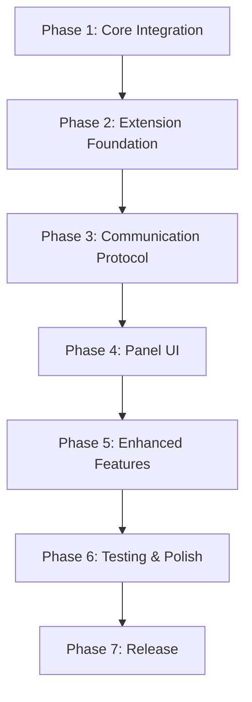

# BlaC DevTools Implementation Plan

## Overview
Build an event-driven Chrome DevTools extension for BlaC state management, providing real-time instance inspection and state monitoring.

## Project Structure
```
packages/
├── blac/                          # Core library modifications
│   └── src/
│       └── devtools/
│           └── DevToolsAPI.ts    # New devtools integration
└── devtools-extension/            # New package
    ├── manifest.json
    ├── package.json
    ├── tsconfig.json
    ├── vite.config.ts
    ├── src/
    │   ├── background/
    │   │   └── service-worker.ts
    │   ├── content/
    │   │   └── content-script.ts
    │   ├── inject/
    │   │   └── inject-script.ts
    │   ├── devtools/
    │   │   ├── devtools.html
    │   │   └── devtools.ts
    │   └── panel/
    │       ├── index.html
    │       ├── index.tsx
    │       ├── components/
    │       ├── hooks/
    │       └── utils/
    └── dist/                     # Build output
```

## Implementation Phases

### Phase 1: Core BlaC Integration
Set up the DevTools API in BlaC core library for exposing instance data.

- [ ] Create DevToolsAPI class in @blac/core #S:m
  - Singleton pattern for global access
  - Event emitter for lifecycle notifications
  - Instance enumeration methods
  - State serialization with circular reference handling

- [ ] Integrate DevToolsAPI with StateContainer #S:m
  - Hook into constructor for 'created' event
  - Hook into dispose() for 'disposed' event
  - Add state change notifications

- [ ] Expose global window API in development mode #S:s
  ```typescript
  window.__BLAC_DEVTOOLS__ = {
    getInstances(): InstanceData[]
    subscribe(callback): () => void
    getVersion(): string
  }
  ```

- [ ] Add serialization utilities #S:s
  - Handle circular references
  - Truncate large objects
  - Convert functions to placeholders
  - Handle special types (Date, Map, Set)

- [ ] Write unit tests for DevToolsAPI #S:m
  - Test instance tracking
  - Test event emissions
  - Test serialization edge cases

### Phase 2: Extension Foundation
Create the Chrome extension structure and basic communication pipeline.

- [ ] Initialize extension package structure #S:s
  - Set up package.json with dependencies
  - Configure TypeScript for extension
  - Set up Vite build configuration

- [ ] Create manifest.json for Manifest V3 #S:s
  ```json
  {
    "manifest_version": 3,
    "name": "BlaC DevTools",
    "permissions": ["scripting", "activeTab"],
    "devtools_page": "devtools/devtools.html"
  }
  ```

- [ ] Implement service worker (background script) #S:m
  - Message routing between content and devtools
  - Connection management for ports
  - State caching for panel reconnection

- [ ] Create content script #S:m
  - Inject script into MAIN world
  - Set up message relay to service worker
  - Handle page navigation and cleanup

- [ ] Implement inject script #S:m
  - Access window.__BLAC_DEVTOOLS__
  - Subscribe to instance changes
  - Serialize and send data to content script

- [ ] Set up devtools page and panel creation #S:s
  - Create devtools.html entry point
  - Use chrome.devtools.panels.create()
  - Initialize panel with loading state

### Phase 3: Communication Protocol
Implement robust message passing between all layers.

- [ ] Define TypeScript interfaces for messages #S:s
  ```typescript
  interface InstanceUpdate {
    type: 'INSTANCE_CREATED' | 'INSTANCE_UPDATED' | 'INSTANCE_DISPOSED'
    payload: InstanceData
  }
  ```

- [ ] Implement message validation and sanitization #S:m
  - Schema validation for all messages
  - Origin checking for security
  - Error boundaries for malformed data

- [ ] Create Port-based communication for devtools panel #P #S:m
  - Establish persistent connection
  - Handle reconnection on panel reopen
  - Queue messages during disconnection

- [ ] Add request-response pattern for queries #P #S:s
  - Get initial state on panel open
  - Refresh specific instance data
  - Handle timeout and retries

- [ ] Implement throttling for high-frequency updates #S:s
  - Batch updates within 16ms window
  - Priority queue for critical updates
  - Drop redundant updates

### Phase 4: Panel UI Implementation
Build the React-based DevTools panel interface.

- [ ] Set up React 18 with Vite #S:s
  - Configure hot module replacement
  - Set up development server
  - Configure production build

- [ ] Create UI component structure #S:m
  ```
  <DevToolsPanel>
    <Header />
    <InstanceList>
      <InstanceItem>
        <InstanceHeader />
        <StateViewer />
      </InstanceItem>
    </InstanceList>
    <StatusBar />
  </DevToolsPanel>
  ```

- [ ] Implement InstanceList component #P #S:m
  - Virtual scrolling for performance
  - Search/filter functionality
  - Sorting by name/time/type

- [ ] Create StateViewer component #P #S:l
  - Collapsible JSON tree
  - Syntax highlighting
  - Copy to clipboard
  - Search within state

- [ ] Add real-time update handling #S:m
  - WebSocket-like updates via Port
  - Diff highlighting for changes
  - Smooth animations for updates

- [ ] Implement UI state management #P #S:m
  - Selected instance tracking
  - Expanded/collapsed states
  - Search/filter state
  - Use Zustand or Context API

- [ ] Style with Tailwind CSS or CSS Modules #P #S:m
  - Dark/light theme support
  - Consistent with Chrome DevTools
  - Responsive layout

### Phase 5: Enhanced Features
Add quality-of-life improvements and polish.

- [ ] Add instance metadata display #P #S:s
  - Creation timestamp
  - Reference count (for shared instances)
  - Instance key
  - Class name with icon

- [ ] Implement state diff view #S:m
  - Show before/after for state changes
  - Highlight changed properties
  - Collapse unchanged sections

- [ ] Add performance metrics #P #S:m
  - Update frequency counter
  - State size indicator
  - Memory usage estimate
  - Listener count

- [ ] Create settings panel #P #S:s
  - Theme selection
  - Update frequency control
  - Data retention limits
  - Export configuration

- [ ] Add keyboard shortcuts #S:s
  - Cmd/Ctrl+F for search
  - Arrow keys for navigation
  - Enter to expand/collapse
  - Cmd/Ctrl+C to copy state

### Phase 6: Testing & Polish
Ensure reliability and professional quality.

- [ ] Write E2E tests for extension #S:l
  - Test installation flow
  - Test instance detection
  - Test state updates
  - Test error scenarios

- [ ] Add error handling and recovery #S:m
  - Graceful degradation
  - Clear error messages
  - Retry mechanisms
  - Fallback UI states

- [ ] Optimize performance #S:m
  - Profile and fix bottlenecks
  - Implement lazy loading
  - Optimize re-renders
  - Minimize memory usage

- [ ] Create user documentation #P #S:m
  - Installation guide
  - Feature overview
  - Troubleshooting section
  - API documentation

- [ ] Prepare for Chrome Web Store #S:m
  - Create promotional images
  - Write store description
  - Set up privacy policy
  - Configure auto-updates

### Phase 7: Release
Package and deploy the extension.

- [ ] Build production extension #S:s
  - Minify and optimize code
  - Generate source maps
  - Create ZIP package

- [ ] Test on multiple Chrome versions #P #S:m
  - Chrome 100+
  - Chrome Canary
  - Chromium-based browsers

- [ ] Submit to Chrome Web Store #S:s
  - Fill submission form
  - Upload package
  - Set up developer account

- [ ] Create GitHub release #P #S:s
  - Tag version
  - Generate changelog
  - Upload artifacts
  - Update README

## Dependencies Between Tasks



## Technical Considerations

### Performance
- **Serialization Cost**: Cache serialized states when unchanged
- **Update Frequency**: Throttle to max 60fps
- **Memory Management**: Limit history to last 100 state snapshots
- **Large States**: Implement virtual scrolling and lazy expansion

### Security
- **Content Security Policy**: Strict CSP in manifest
- **Message Validation**: Never trust data from page context
- **No Eval**: Avoid dynamic code execution
- **Sanitization**: Clean all user-visible content

### Browser Compatibility
- **Primary Target**: Chrome 100+ with Manifest V3
- **Future Support**: Firefox with minor modifications
- **Edge**: Should work without changes (Chromium-based)

### Error Recovery
- **Connection Loss**: Automatic reconnection with state recovery
- **Malformed Data**: Fallback to raw display with error indicator
- **Extension Crash**: Service worker restart with state restoration
- **Page Navigation**: Clean re-initialization

## Estimated Timeline

- **Phase 1**: 1 day (Core Integration)
- **Phase 2**: 1 day (Extension Foundation)
- **Phase 3**: 1 day (Communication Protocol)
- **Phase 4**: 2 days (Panel UI)
- **Phase 5**: 1 day (Enhanced Features)
- **Phase 6**: 1 day (Testing & Polish)
- **Phase 7**: 0.5 days (Release)

**Total**: ~7.5 days for complete implementation

## MVP Milestone (Day 3)
After Phase 3, we have a working extension that:
- Detects BlaC instances
- Shows real-time state updates
- Has basic UI for inspection

This could be released as an alpha version for early feedback.

## Success Criteria

- [x] Zero-configuration setup
- [x] Real-time state updates (<50ms latency)
- [x] Handle 1000+ instances
- [x] Professional UI matching Redux DevTools quality
- [x] Stable operation without crashes
- [x] Clear documentation